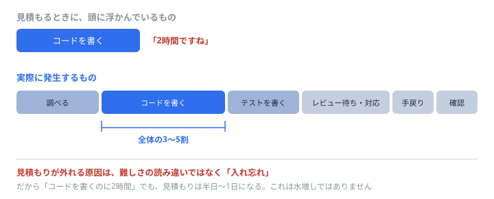

# どれくらいで終わる？ — 工数の見積もり方

<div class="lead">
案件に入って、いちばん早く聞かれる質問がこれです。<br>
<b>「これ、どれくらいでできそう？」</b><br>
ここで「やってみないと分かりません」しか言えないと、仕事が任されなくなります。<br>
逆に、<b>根拠のある数字を出せる人</b>は、経験が浅くても信頼されます。作業はありません。読むだけです。
</div>

## まず、いちばん大事なこと

**見積もりは、約束ではありません。**

<div class="checkpoint">
<strong>見積もり＝「今わかっている情報での、現時点の見通し」</strong><br>
約束（コミットメント）とは別物です。ここを混ぜると、<b>外れたときに「嘘をついた」ことになってしまいます。</b>
</div>

だから、見積もりを出すときは**必ず前提とセットで**出します。

> 「**タスクの検索機能だけ**で、**既存のテストは直さない前提**なら、**2〜3日**です。
> 　もしテストも書くなら、**+1日**見てください」

この形なら、前提が崩れたときに「話が違う」ではなく「**前提が変わったので、見直しましょう**」になります。**これが、見積もりのいちばん大事な性質です。**

## 見積もれないのは、能力が足りないからではありません

<div class="qa">
<div class="q">「3日か、3週間か、正直まったく分かりません」</div>
<div class="a">それは<b>正常な反応</b>です。そして<b>正確な情報でもあります。</b>「まだ分かっていない」ということが分かっているのですから。<br>問題は、そこで黙ることです。<b>「調べる時間を半日ください。そうすれば見積もれます」</b>と言ってください。これは立派な回答です。</div>
</div>

<div class="checkpoint">
<strong>見積もりの精度は、そのまま「理解の深さ」です。</strong><br>
見積もれない＝まだ分かっていない。<b>だから、見積もろうとすると、何が分かっていないかが浮かび上がります。</b>これが見積もりの隠れた効能です。
</div>

## 基本のやり方: 分解する

**塊のままでは、絶対に見積もれません。** 唯一の方法は、**分けること**です。

<div class="column">
<div class="ct">やってみると分かること</div>
<p>「タスク一覧アプリを作る」は見積もれません。でも「①データを読む ②一覧を表示する ③チェックを付けられるようにする ④件数を出す」まで割ると、<b>それぞれは急に見積もれるようになります。</b></p>
<p>これは<a href="ai-dlc.html" target="_blank" rel="noopener">AIと回す開発の一周</a>でやった「作業を30分の単位に割る」と、まったく同じ作業です。<b>あれは見積もりの練習でもありました。</b></p>
</div>

**分解の止めどきは、はっきりしています。**

| 1つの塊が… | 判定 |
| --- | --- |
| **半日（4時間）を超える** | **まだ分解が足りません。** もう1段割ってください |
| 30分〜半日に収まる | ちょうどいい大きさです |
| 5分で終わる | 割りすぎです。まとめてください |

<div class="note">
<b>「半日を超えたら割る」は、経験則ですが強力です。</b> 半日より大きい塊は、中に「実はよく分かっていない部分」が隠れています。割ろうとして手が止まったら、<b>そこが分かっていない場所</b>です。
</div>

## 忘れられる工数（ここが一番ズレます）

見積もりが外れる原因は、たいてい**難しさの読み違い**ではありません。**入れ忘れ**です。



**「コードを書く時間」は、全体の3〜5割程度**しかありません。残りはこれです。

| 忘れがちなもの | 中身 |
| --- | --- |
| **調べる時間** | どこを直すか探す、仕様を確認する、聞く |
| **環境の時間** | 動かす、動かない、直す（初回はここが一番かかります） |
| **テストを書く時間** | [#5でやりました](https://github.com/aq35/trainer-practice/blob/main/tickets/05-tests.md)。書くなら見積もりに入れます |
| **レビュー待ち・レビュー対応** | 出してから取り込まれるまで。**自分の手は動いていないのに、日数は進みます** |
| **手戻り** | 「やっぱりこうしたい」。ゼロにはなりません |
| **会議・報告・確認** | 1日のうち、意外と削られています |
| **デプロイと動作確認** | 出して終わりではありません |

<div class="checkpoint">
<strong>だから「コードを書くのに2時間」なら、見積もりは2時間ではありません。</strong><br>
半日〜1日です。<b>これは水増しではなく、実際にかかる時間です。</b>
</div>

## 3つの数字で出す

1つの数字だけ出すと、**必ず楽観側に寄ります**。人間はそういうふうにできています。だから3つ出します。

| | 意味 |
| --- | --- |
| **楽観** | 何も詰まらなければ |
| **現実** | たぶんこれくらい |
| **悲観** | 詰まるところで全部詰まったら |

そして、**真ん中あたりを取ります。**

<div class="column">
<div class="ct">ちょっと寄り道: 計算式</div>
<p>現場では、こういう式が使われることがあります。</p>
<p><b>（楽観 ＋ 現実×4 ＋ 悲観）÷ 6</b></p>
<p>楽観1日・現実2日・悲観6日なら、(1 + 8 + 6) ÷ 6 = <b>2.5日</b>。<br>
現実の2日より少し大きくなります。<b>悲観側の重みが、少しだけ効く</b>ようになっているのがポイントです。</p>
<p><b>覚えなくて構いません。</b>大事なのは式ではなく、<b>「3つ考えると、1つだけ考えたときより必ず大きくなる」</b>という事実のほうです。</p>
</div>

<div class="qa">
<div class="q">悲観の数字を出すと、「かかりすぎ」と言われませんか？</div>
<div class="a"><b>そのための3点セットです。</b>「順調なら1日、たぶん2日、最悪6日です。6日になるのは〇〇が想定と違ったときで、そこは最初の半日で分かります」——こう言えば、相手は<b>リスクの中身まで理解できます。</b>数字1つより、ずっと納得されます。</div>
</div>

## バッファは、隠さない

<div class="checkpoint">
<strong>「3日だけど、念のため5日と言っておこう」——これはやめてください。</strong><br>
バレるからではありません。<b>隠したバッファは、必ず溶けてなくなるから</b>です。
</div>

理由は2つあります。

- **人は、与えられた時間をすべて使います**（3日でできる仕事は、5日あれば5日かかります）
- **余裕があると、着手が遅れます**（そして最後に慌てます）

**だから、分けて見せます。**

> 「**作業そのものは3日**です。ただし〇〇が未確認なので、**不確実性ぶんを2日**見ています。合計5日で置いてください」

こう出すと、相手は「じゃあ〇〇を先に確認すれば、2日縮むんですね」と**判断できるようになります。** 隠したバッファには、この効果がありません。

## 単位と、精度のふり

**「2.5人日」より「2〜3日」と言ってください。**

細かい数字は、**精度が高いように見えてしまいます。** 実際にはそんな精度は無いのに、相手はあると思って予定を組みます。それが事故のもとです。

| 期間 | 使う単位 |
| --- | --- |
| 数時間〜数日 | **時間 / 日** |
| 1〜2週間 | **日**（「4〜6日」） |
| 1か月以上 | **週**（「3〜4週間」）。日で言わないこと |

<div class="note">
<b>「人日」「人月」という言い方</b>は、<b>1人が1日（1か月）働く量</b>を表します。「3人日」なら、1人なら3日、3人なら1日……<b>とは限りません。</b>人を増やすと説明や調整が増えるので、単純に割り算はできません。<b>ここは有名な落とし穴です。</b>
</div>

## いちばん精度が上がる方法: 前と比べる

<div class="checkpoint">
<strong>人間は、絶対的な時間を当てるのが下手です。でも「比べる」のは得意です。</strong>
</div>

だから、こう考えます。

> 「この検索機能、**前にやったタグ表示の修正と同じくらい**だな。あれは2日だった。じゃあ2日」

これは**相対見積もり**という考え方で、実際の現場でよく使われます。**過去の実績が、そのまま物差しになります。**

**そのためには、実績を残しておく必要があります。** これが次の話です。

## 自分の「係数」を知る

**見積もりが上手い人は、勘がいいのではありません。自分のクセを知っているだけです。**

やることは1つ。**見積もりと、実際にかかった時間を、両方記録する。**

| 作業 | 見積もり | 実績 | 倍率 |
| --- | --- | --- | --- |
| チケット#3 タグの404 | 1時間 | 3時間 | **3.0倍** |
| チケット#2 期限切れ | 2時間 | 3時間 | **1.5倍** |
| チケット#1 検索 | 4時間 | 7時間 | **1.75倍** |

**3回もやれば、自分の癖が見えてきます。** 「自分は だいたい2倍かかる」と分かれば、**次から2倍して出せばいい**だけです。それだけで、見積もりの精度は劇的に上がります。

<div class="trivia">
<div class="ct">豆知識</div>
ベテランほど見積もりが大きくなる、とよく言われます。腕が落ちたからではなく、<b>「何が起きうるか」を知っているから</b>です。<br>
逆に、経験が浅いうちに見積もりが小さくなるのは、<b>知らないことが見えていないから</b>。これは能力ではなく、情報量の差です。<b>記録を取れば、埋まります。</b>
</div>

## AIに見積もらせていい？

**分解はさせてください。時間の数字は、信用しないでください。**

<div class="qa">
<div class="q">なぜ、AIの出す時間はあてにならないんですか？</div>
<div class="a"><b>あなたの速さも、あなたの環境も、そのチームの事情も知らないから</b>です。レビューに何日かかるか、環境構築でどれだけ詰まるか、AIには分かりません。そして<b>AIは楽観的な数字を出しがち</b>です。<br>ただし<b>「作業を分解して」「抜けている観点はある？」は非常に得意</b>です。そこだけ使ってください。</div>
</div>

**そのまま使える頼み方はこれです。**

```
この作業を見積もりたいので、手伝ってください。時間や日数は言わなくて構いません。

やりたいこと: （ここに書く）

お願いしたいこと:
1. 作業を、それぞれ半日以内で終わる単位に分解してください
2. 分解した中で、「まだ決まっていない・確認が必要」なものに印を付けてください
3. 見落としがちな作業（調査・テスト・レビュー対応・確認など）で、
   抜けているものがあれば指摘してください
```

**3番が本命です。** 入れ忘れを見つけるのは、AIがいちばん役に立つところです。

## やってはいけない4つ

| | なぜダメか |
| --- | --- |
| **気合で縮める**（「頑張れば2日」） | 頑張りは工数ではありません。**必ず外れます** |
| **相手の希望に合わせる** | 「3日でお願い」と言われて根拠なく「はい」と言うのは、見積もりではなく<b>返事</b>です |
| **一人で抱えて悩む** | 30分考えて分からなければ、**分解を手伝ってもらってください** |
| **外れたのを黙っている** | いちばん高くつきます。→ [詰まったときに、人を頼る](ask.html ':ignore target=_blank') |

<div class="checkpoint">
<strong>「3日でお願いできる？」と言われたときの、正しい返し方。</strong><br>
「はい」でも「無理です」でもありません。<br>
<b>「3日だと、〇〇まではできます。△△は入りません。それでよければ大丈夫です」</b><br>
——<b>期間ではなく、範囲で調整する。</b>これが、プロの答え方です。
</div>

## ずれ始めたら、その日に言う

どれだけ丁寧に見積もっても、**外れるときは外れます。** そこは問題ではありません。

**問題になるのは、締切の日に初めて報告することです。**

> 「〇〇が想定より複雑で、いまのペースだと**あと2日かかりそう**です。
> 　優先度を下げてもよい部分があれば、教えてください」

**気づいた日に、これを言ってください。** 見積もりの技術より、この一言のほうが信頼を守ります。

## 独立を考えている人へ

<div class="note">
<b>工数の見積もりと、金額の見積もりは別の話です。</b> このページは<b>工数だけ</b>を扱っています。<br>
ただし、金額は工数の上に乗るので、<b>工数が読めない人は、金額も出せません。</b>逆に言えば——<b>ここが読めるようになることが、独立の最初の土台</b>になります。<br>
契約や請求の話は、この教材の範囲を超えます。<b>実際に独立するときは、必ず専門家に確認してください。</b>
</div>

## まとめ

- 見積もりは**約束ではなく、現時点の見通し**。**必ず前提とセットで**出す
- **見積もれない＝まだ分かっていない**。それも正確な情報。「調べる時間をください」でよい
- **分解する。半日を超える塊は、まだ割り足りない**
- **コードを書く時間は全体の3〜5割**。調査・テスト・レビュー・手戻りを入れ忘れる
- **楽観／現実／悲観の3つ**で考える。1つだけだと必ず楽観に寄る
- **バッファは隠さず、分けて見せる**
- **見積もりと実績を記録する。** 3回で自分の倍率が分かる
- **AIには分解と抜け漏れチェックだけ**させる。時間の数字は信用しない
- 「3日で？」には**範囲で答える**。ずれたら**その日に言う**

---

寄り道はここまでです。おつかれさまでした。

- 👉 次に進む → [レビューする側になる](review.html ':ignore target=_blank')
- 伝え方の続き → [詰まったときに、人を頼る](ask.html ':ignore target=_blank')
- 分解の実践 → [AIと回す開発の一周](ai-dlc.html ':ignore target=_blank')
- 全体を見る → [トップページ](/)
