# 用語集

聞き慣れない言葉が出てきたら、ここに戻ってきてください。**全部覚える必要はありません。**

<div class="note">
研修中に出てくる言葉だけを載せています。ここに無い言葉が出てきたら、そのまま Claude に「〇〇ってどういう意味？初心者向けに説明して」と聞いてください。
</div>

---

## 道具の名前

### ターミナル（黒い画面）

文字でパソコンに命令する画面のこと。Windowsでは「コマンドプロンプト」「PowerShell」とも呼ばれます。アイコンをクリックする代わりに、文字で指示すると考えてください。

→ [ターミナル入門](step0-terminal.md)

### && が使えない（Windows のとき）

ネットや**AIの回答には、こういう1行がよく出てきます。**

```
git switch main && git pull
```

`&&` は「**前が成功したら、次を実行する**」という意味です。Mac のターミナルでは動きますが、**Windows に最初から入っている PowerShell では、これはエラーになります。**

```
The token '&&' is not a valid statement separator in this version.
```

<div class="note">
<b>この教材のコマンドには <code>&&</code> を使っていません。</b>どのパソコンでも同じように動くよう、<b>1行ずつに分けて</b>あります。<br>
ただし<b>AIに頼むと <code>&&</code> 付きで返ってくることがあります</b>。そのときは慌てず、<b>自分で1行ずつに分けて打ってください。</b>それで同じことができます。
</div>

**なぜこうなるのか。** `&&` は PowerShell 7 から使えるようになったもので、Windows に標準で入っているのは**それより前のバージョン**だからです。「使えないほうが古い」というだけの話で、あなたのパソコンが壊れているわけではありません。

### VS Code（ブイエス・コード）

プログラムを書くためのアプリ。文章を書くWordのようなものですが、プログラム向けの便利機能がたくさん付いています。

### 拡張機能

VS Code に後から足せる追加パーツ。研修では Claude Code という拡張機能を入れます。スマホにアプリを追加するのと同じ感覚です。

→ もっと詳しく: [なぜ VS Code なのか？ 拡張機能って何？](why-vscode.md)

### Live Server（ライブサーバー）

VS Code に足す**拡張機能**のひとつ。押すと、**あなたのパソコンが一時的にサーバーになります**。

**なぜ必要なのか。** HTMLファイルを**ダブルクリックで開くと、動かないものがあります**。ブラウザが「これはただのファイル」として開いてしまい、**他のファイルを読みに行くことを許してくれない**からです。Live Server で開くと、ブラウザから見て**ちゃんとしたWebページ**になるので、データの読み込みも動きます。

| | ダブルクリックで開く | Live Server で開く |
| --- | --- | --- |
| アドレス欄 | `file:///C:/...` | **`http://127.0.0.1:5500/...`** |
| データの読み込み | **動かない** | 動く |
| 保存したとき | 自分で再読み込み | **勝手に画面が更新される** |

**入れ方**（研修では「[仕事の一周](work.html ':ignore target=_blank')」の4番目でやります）

1. VS Code の左端の**拡張機能アイコン**（四角が4つ）を押す
2. 検索欄に **Live Server** と入れる
3. 作者が **Ritwick Dey** のものを **Install**

**使い方** — ファイル一覧で `index.html` を**右クリック → Open with Live Server**。
止めるときは、画面下の青い帯の **Port: 5500** を押します。

<div class="note">
<b>Node.js は要りません。</b>この拡張機能1つで足ります。「<a href="#/what-is-service">サービスって何？</a>」で読んだ<b>「自分のPCを一時的にサーバーにする」</b>が、まさにこれです。
</div>

### 開発者ツール（デベロッパーツール／検証／DevTools）

ブラウザに最初から入っている、**ページの中身を見るための道具**。Chrome でも Edge でも <code>F12</code>（Mac は <code>Cmd + Option + I</code>）、または**右クリック →「検証」**で開きます。開いてもページは壊れません。

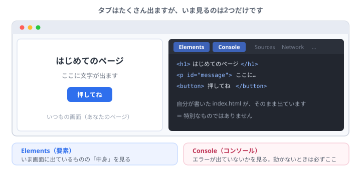

使うのは、この3つのタブだけです。

- **Elements（要素）** … いま画面に出ているものの中身を見る。行にマウスを乗せると、画面のどこかを教えてくれます
- **Console（コンソール）** … **ブラウザの中**で起きたことが出ます。エラーや `console.log` の結果
- **Network（ネットワーク）** … **境目を通った通信**が全部出ます。何を頼んで、何が返ってきたか

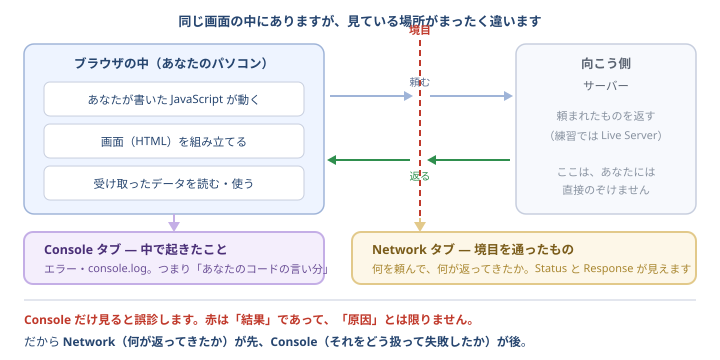

<div class="note">
<b>Console と Network は、見ている場所が違います。</b>ここを混ぜると必ず誤診します。<br>
<b>Console の赤は「結果」であって「原因」とは限りません。</b>だから <b>Network（何が返ってきたか）が先、Console（それをどう扱って失敗したか）が後</b>。<br>
Network が読みにくいときは、上の <b>Fetch/XHR</b> を押すと、データのやり取りだけに絞れます。
</div>

ここで文字を書き換えても、**変わるのは自分の画面だけ**でファイルは無傷です。再読み込みすれば元に戻ります。

→ [APIと、問題の切り分け](api.html ':ignore target=_blank')

---

## git まわり

### git（ギット）

変更の履歴を残す道具。**ゲームのセーブポイント**だと思ってください。

→ もっと詳しく: [なぜ git が生まれたのか](why-git.md)

### リポジトリ

履歴を管理している**フォルダ1つ分**のこと。「このフォルダは git で管理しています」という状態のフォルダを、リポジトリと呼びます。

### コミット

**セーブすること**、またはセーブした記録1つのこと。「コミットする」＝「今の状態を記録する」。

### ステージ

コミットする前に、**記録したいファイルを並べておく台**。`git add` で載せます。写真に写る人を選んでから、シャッターを切るイメージです。

### 差分（さぶん / diff）

変更前と変更後を見比べて、**変わったところだけ**を抜き出したもの。

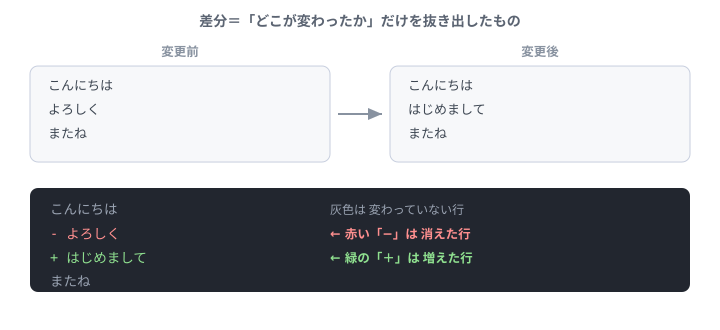

- **緑の `+`** … 増えた行
- **赤の `-`** … 消えた行
- 灰色 … 変わっていない行

→ [差分を読む](diff.html ':ignore target=_blank')

### ブランチ

**本線を汚さずに試すための、分かれ道**のこと。

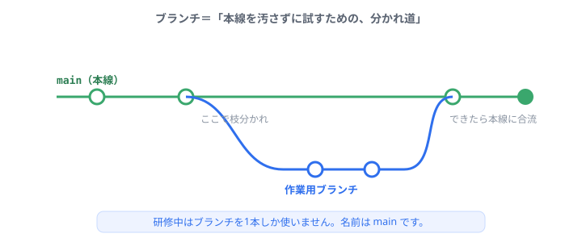

実際の開発では、機能ごとに枝分かれして作業し、できあがったら本線に合流させます。

研修でも、はじめのうちは **`main` という本線1本だけ**で進めます。枝分かれのやり方は、後半の[ブランチと安全な進め方](branch.html ':ignore target=_blank')で練習します。

「Branch の公開」というボタンは、「**この作業の記録をGitHubに置く**」という意味だと思ってください。

### コンフリクト（衝突）

**同じ行を2か所で別々に直したときに、git が「どちらを残す？」と聞いてくる状態**のこと。壊れたわけではありません。

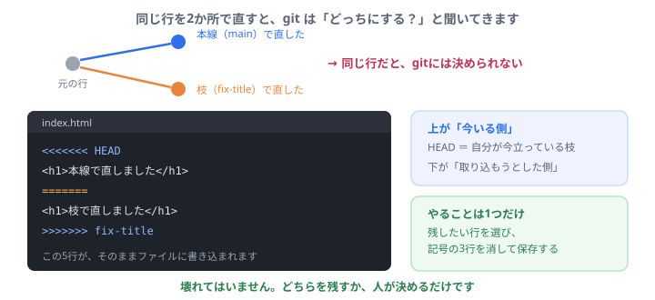

残したい行を選び、`<<<<<<<` `=======` `>>>>>>>` の3行を消して保存 → `add` → `commit` で解決します。やめたくなったら `git merge --abort` で始める前に戻せます。

→ [ブランチと安全な進め方](branch.html ':ignore target=_blank')

### main（メイン）

いちばん基本になるブランチの名前。多くのプロジェクトで、これが本線です。

### GitHub（ギットハブ）

git の記録を**インターネット上に置いておく場所**。パソコンが壊れても残り、仲間と同じものを見られるようになります。**git とは別のサービス**で、作った会社も違います。

### push（プッシュ）／ 公開 ／ 同期

手元の記録を**GitHubに送ること**。VS Code のボタンでは「Branch の公開」「変更の同期」と表示されます。

### clone（クローン）

GitHub にあるものを、**自分のパソコンにコピーしてくること**。研修の後半で出てきます。

### origin（オリジン）／ pull（プル）／ fetch（フェッチ）

**`origin` は「GitHub 上の置き場所」に付けたあだ名**です。毎回長いURLを打たずに済むよう、`git clone` したときに自動で付きます。

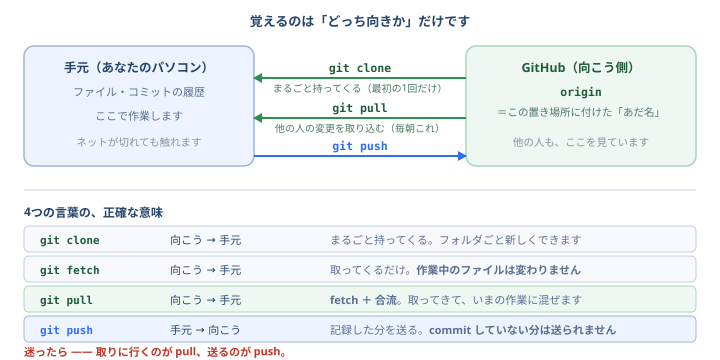

| | 向き | 何をするか |
| --- | --- | --- |
| `git clone` | 向こう → 手元 | **まるごと**持ってくる。最初の1回だけ |
| `git fetch` | 向こう → 手元 | 取ってくる**だけ**。作業中のファイルは変わりません |
| **`git pull`** | 向こう → 手元 | **fetch ＋ 合流**。取ってきて、いまの作業に混ぜます |
| `git push` | 手元 → 向こう | 記録した分を送る。**commit していない分は送られません** |

<div class="note">
<b>迷ったら —— 取りに行くのが pull、送るのが push。</b><br>
案件では、<b>作業を始める前に必ず <code>git pull</code></b> します。他の人が進めた分を先に取り込んでおかないと、あとでコンフリクトが増えるからです。
</div>

### git pull が止まった（Aborting / CONFLICT）

**`git pull` は、よく止まります。ほとんどの場合、壊れていません。** 止まり方は3つだけです。

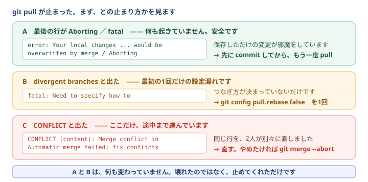

| 最後の行 | 何が起きたか | やること |
| --- | --- | --- |
| `Aborting` | **何も起きていません。** 保存しただけの変更が邪魔しています | `git add .` → `git commit -m "作業中"` → もう一度 `git pull` |
| `Need to specify how to reconcile divergent branches` | **設定していないだけ**です（最初の1回だけ） | `git config --global pull.rebase false` を1回 |
| `CONFLICT` | **ここだけ、途中まで進んでいます。** 同じ行を2人が直しました | 記号の行を消して直す → `git add` → `git commit`。やめるなら `git merge --abort` |

```
error: Your local changes to the following files would be overwritten by merge:
	public/logic.js
Please commit your changes or stash them before you merge.
Aborting
```

<div class="checkpoint">
<strong>いちばん多い勘違いは、<code>Aborting</code> を見て「壊した」と思うことです。逆です。</strong><br>
git が<b>「このままだとあなたの変更が消えるので、やめておきました」</b>と言っています。<b>あなたのファイルは1文字も変わっていません。</b><code>git status</code> で確かめられます。
</div>

<div class="note">
<b><code>git stash</code> はどうか。</b>「commit したくない中途半端な状態」を一時的にどけられますが、<b>戻すとき（<code>git stash pop</code>）に結局コンフリクトすることがあります</b>。<b>慣れるまでは commit するほうが確実です。</b>「作業中」という名前の commit は、あとでいくらでも整理できます。
</div>

<div class="note">
<b><code>unmerged files</code> と言われて何も進まないとき</b>は、<b>コンフリクトを直しきる前に次の操作をしています</b>。<code>git status</code> で <b>both modified</b> と出ているファイルを片付けるまで、git は他のことをさせてくれません。
</div>

### テストの4段（単体・結合・機能・シナリオ）

**どのテストにも「見ていないもの」があります。** 大事なのは書き方ではなく、**そのテストが何を保証して、何を保証しないかを言えること**です。

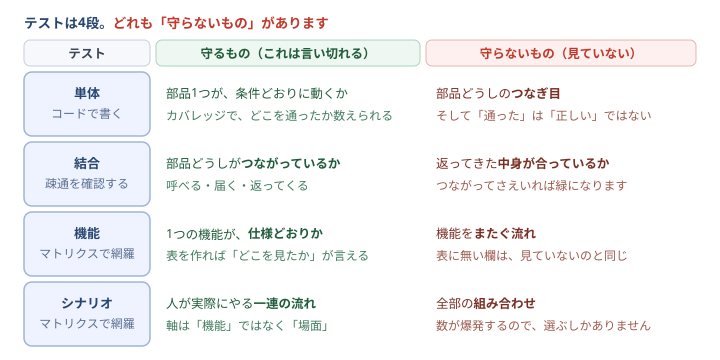

| | 守るもの | 守らないもの | 網羅の示し方 |
| --- | --- | --- | --- |
| **単体** | 部品1つが条件どおりか | **つなぎ目** | カバレッジ（機械が数える） |
| **結合** | つながっているか（**疎通**） | **返ってきた中身** | 経路を数える |
| **機能** | 1つの機能が仕様どおりか | **機能をまたぐ流れ** | **マトリクス** |
| **シナリオ** | 人が実際にやる一連の流れ | **全部の組み合わせ** | **マトリクス**（軸が「場面」） |

<div class="checkpoint">
<strong>名前は現場によって変わります。揉めないでください。</strong><br>
聞くべきはいつも同じです —— <b>「それは何を保証していますか」</b>
</div>

### カバレッジ

**テストが「通った行」の割合**です。**「正しい行」の割合ではありません。**

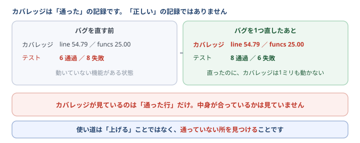

練習リポジトリで実際に測ると、こうなります。

```
file      | line % | branch % | funcs % | uncovered lines
logic.js  |  54.79 |   100.00 |   25.00 | 36-37 44-47 54-55 …
```

**`funcs 25.00`** ＝ 8つある関数のうち、テストが触っているのは**2つだけ**。**「テストがある」と「テストされている」は別物**です。

<div class="checkpoint">
<strong>不具合を1つ直しても、カバレッジの数字は1ミリも動きません。</strong><br>
（<code>54.79 / 25.00</code> のまま。落ちていたテストが2件通るようになるだけです）<br>
<code>&gt;</code> でも <code>&lt;</code> でも、その行は同じように「通った」と数えられるからです。
</div>

- **×** 「80%を超えたから安心」…… 何も保証していません。**結果を `assert` しないテストを書けば、数字はいくらでも上がります**
- **◯** 「`uncovered lines` に、お金の計算が入っている。ここは通しておこう」

**割合ではなく、場所を見てください。** 実際にやるのは [テストは4段](test.html ':ignore target=_blank') です。

### 更新系の3つの問い（副作用）

**データを書き換える処理を読むときは、毎回この3つを聞きます。** 読むだけの処理と違い、**更新は戻せないことがあります。**

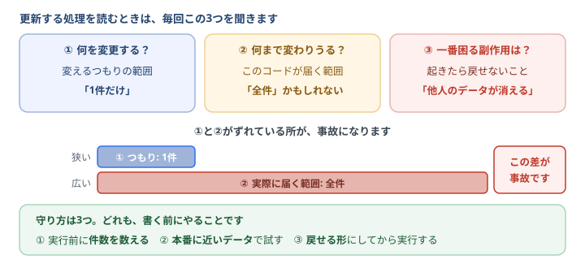

| | 聞くこと | 例 |
| --- | --- | --- |
| ① | **何を変更する？** | 変えるつもりの範囲 —— 「1件だけ」 |
| ② | **何まで変更される可能性がある？** | このコードが実際に届く範囲 —— 「全件かもしれない」 |
| ③ | **一番困る副作用は何？** | 起きたら戻せないこと —— 「他人のデータが消える」 |

**①と②がずれている所が、事故になります。**

```sql
UPDATE tasks SET done = 1;                 -- changes = 12  ← 全件
UPDATE tasks SET done = 1 WHERE id = ?;    -- changes = 1
```

<div class="checkpoint">
<strong>「仕様を完璧に書く」より、この問いのほうが速いです。</strong><br>
—— <b>「この処理で、一番壊したくないものは何か？」</b><br>
これが答えられれば、<b>守る場所が決まります</b>。事故の多くは<b>仕様が甘かったのではなく、この問いが手順に入っていなかった</b>だけです。
</div>

**守り方は3つ。どれも「実行する前」にやります。**

- **① 先に件数を数える** —— 同じ条件で `SELECT COUNT(*)`。**1件のはずが12件と出れば、そこで止まれます**
- **② 本番に近いデータで試す** —— 手元の3件では気づけません。**本番と同じくらいの件数・同じ形**で
- **③ 戻せる形にしてから実行する** —— バックアップ、またはトランザクション（`BEGIN` … `ROLLBACK` で戻せます）

<div class="note">
<b>レビューでも、そのまま聞けます。</b>「件数は確認しましたか」「どのデータで試しましたか」——<b>この2つだけで、かなり防げます。</b><br>
実際にやるのは <a href="review.html ':ignore target=_blank'">レビューする側になる</a>（読む側）と <a href="db.html ':ignore target=_blank'">保存先を変えてみる</a>（書く側）です。
</div>

### コンフリクトを小さくする（チーム開発）

**コンフリクトの大きさは、腕前ではなく「取り込まずに持っていた日数」で決まります。**

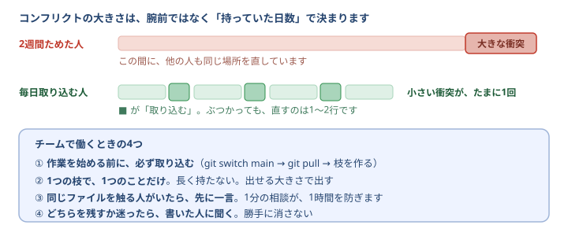

- **① 作業を始める前に、必ず取り込む** — `git switch main` → `git pull` → それから枝を作る
- **② 1つの枝で、1つのことだけ。長く持たない** — 2週間ためた枝は、2週間ぶんの衝突を連れてきます
- **③ 同じファイルを触る人がいたら、先に一言** — **1分の相談が、1時間の解決を防ぎます**
- **④ どちらを残すか迷ったら、書いた人に聞く** — **勝手に消さないでください**

<div class="note">
<b>④がいちばん大事です。</b>コンフリクトの解決は、技術ではなく<b>判断</b>です。どちらが正しいかは<b>書いた人にしか分かりません</b>。「どちらを残しますか」と1行聞くだけで済みます。
</div>

<div class="note">
<b>一人でも起きます。</b>会社のPCと自宅のPC、というように<b>2か所で同じリポジトリを触ったとき</b>です。「チームがいないから関係ない」ではありません。
</div>

### git switch（スイッチ）／ git merge（マージ）／ git restore（リストア）

**コマンドは「どこに効くか」で覚えます。**

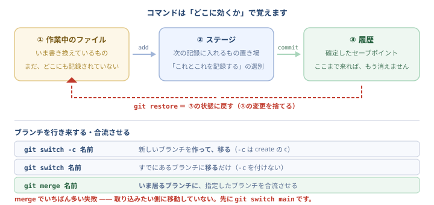

| コマンド | すること |
| --- | --- |
| `git switch -c 名前` | 新しいブランチを**作って、移る**（`-c` は create の c） |
| `git switch 名前` | すでにあるブランチに**移る**だけ |
| `git merge 名前` | **いま居るブランチに**、指定したブランチを合流させる |
| `git restore ファイル名` | **最後の記録の状態に戻す**（書きかけの変更を捨てる） |

<div class="note">
<b><code>git merge</code> でいちばん多い失敗は、取り込みたい側に移動していないこと。</b>先に <code>git switch main</code> です。<br>
<b><code>git restore</code> は「元に戻す」の相棒です。</b>研修では何度も壊してもらいますが、これがあるから安心して壊せます。
</div>

### プルリクエスト（PR / Pull Request）

**「この変更、本線に入れていいですか？」という申請**です。ブランチで作業したものを、`main` に取り込む前に**いったん止めて、見てもらう**ための仕組みです。

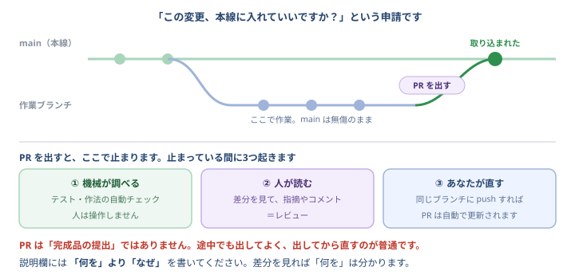

止まっている間に、3つのことが起きます。

1. **機械が調べる** — テストや作法の自動チェック。人は操作しません
2. **人が読む** — 差分を見て指摘やコメント（＝**レビュー**）
3. **あなたが直す** — 同じブランチに push すれば、**PRは自動で更新されます**

<div class="note">
<b>PR は「完成品の提出」ではありません。</b>途中でも出してよく、<b>出してから直すのが普通</b>です。<br>
説明欄には<b>「何を」より「なぜ」</b>を書いてください。「何を」変えたかは、差分を見れば分かります。
</div>

→ [ブランチと安全な進め方](branch.html ':ignore target=_blank') ／ [レビューする側になる](review.html ':ignore target=_blank')

### Issue（イシュー）

GitHub 上の**「やることリスト」や「困りごとの報告」の1枚**。不具合の報告、機能の要望、質問など、何でも1件ずつ立てます。PR と違って、**コードは含みません**。

### .gitignore（ギットイグノア）

**git に記録させたくないファイル**を書いておくファイル。ここに書いたものは、`git add .` をしても記録されません。

**入れるもの** — パスワードや鍵が入ったファイル、データベースの実体（`*.db`）、自動で作られるフォルダ。
**理由** — 一度 push してしまうと、**あとで消しても履歴に残ります**。

### 自動チェック（GitHub Actions / CI）

**PR を出すと、勝手に走る検査**のこと。テストを走らせたり、作法を確かめたりします。

**AI ではありません。** 決められた手順を、機械がそのまま実行しているだけです。だから**毎回まったく同じ判定**になり、そこが価値です。**CI**（Continuous Integration）とも呼ばれます。

---

## Web とサービスまわり

### サーバー ／ クライアント

**サーバー** ＝ 頼まれたものを返す側。**クライアント** ＝ 頼む側（あなたのブラウザ）。
特別な機械という意味ではなく、**役割の名前**です。あなたのパソコンも Live Server を動かせばサーバーになります。

→ もっと詳しく: [サービスって何？](what-is-service.md)

### API（エーピーアイ）

**決まった形で頼むと、決まった形で返ってくる「注文口」**のこと。レストランの注文口と同じで、**厨房の中がどうなっているかは知らなくていい**のがポイントです。

外部サービスのものだけでなく、**自分の会社のサーバーにも必ず API があります**。案件で毎日触るのは、そちらです。

### JSON（ジェイソン）

**データをやり取りするときの、いちばんよく使う書き方**。人が読める文字なのに、プログラムからも扱えます。

```json
[ { "id": 1, "title": "買い物に行く", "done": false } ]
```

**カンマの付け忘れ・閉じ括弧の不足**で壊れやすく、壊れると `SyntaxError` が出ます。

### ステータスコード（200 / 404 / 500 など）

サーバーが返す**3桁の番号**。全部覚える必要はなく、**最初の1桁だけ**で、どちらのせいか決まります。

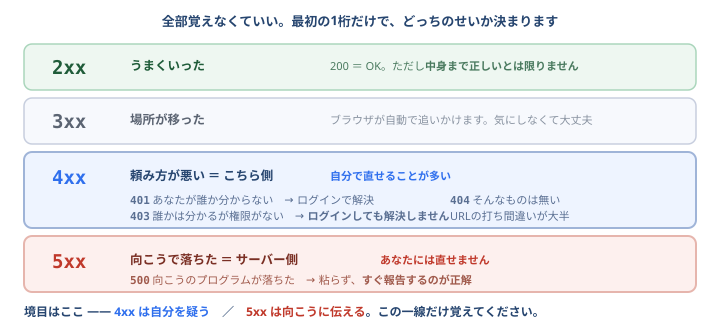

**4xx は自分を疑う／5xx は向こうに伝える。** この一線だけ覚えてください。

→ [APIと、問題の切り分け](api.html ':ignore target=_blank')

### CORS（コルス）

**「このページから、そのサーバーを呼ぶ許可がない」**という意味のエラー。Console に長い英語で出ます。

**サーバー側の設定で解決するもの**なので、フロント側では直せません。見分けたら、サーバー担当に伝えてください。

### XSS（クロスサイトスクリプティング）

**入力された文字が、そのままプログラムとして実行されてしまう**事故。タスク名に `<script>` と書けたら実行されてしまう、というような状態です。

事故の種類として**最も多いもののひとつ**なので、**外から受け取った文字をそのまま画面に埋め込まない**、とだけ覚えておいてください。

### デプロイ

**作ったものを、実際に動く場所に置くこと**。研修では GitHub Pages への公開がこれにあたります。

「本番に上げる」「リリースする」もほぼ同じ意味で使われます。

---

## 開発の作法まわり

### テスト ／ 単体テスト ／ E2E

**プログラムが正しく動くかを、機械に確かめさせるコード**。人が毎回クリックして確認する代わりになります。

| | 見ているもの |
| --- | --- |
| **単体テスト** | 関数ひとつひとつ。**部品**が正しいか |
| **E2E**（End to End） | ブラウザを自動で操作して、画面まで。**組み立て**が正しいか |

<div class="note">
<b>テストの本当の効き目は、書いた瞬間ではありません。</b>半年後、別の人が別の場所を直したときに「壊した」と教えてくれることです。<b>だから、書き直す勇気の源にもなります。</b>
</div>

### リファクタリング

**動きを変えずに、コードを読みやすく書き直すこと**。機能は1つも増えません。

**テストがあるから、安全にできます。** 書き直して、テストが緑のままなら「壊していない」と分かるからです。

### Node.js（ノード）／ npm（エヌピーエム）

**Node.js** … ブラウザの外で JavaScript を動かすための土台。**npm** … そこに付いてくる道具箱で、`npm test` のように使います。

**この研修では、9番までは入れなくて構いません**（Live Server で足ります）。`npm test` を使う回だけ必要になります。→ [nodejs.org](https://nodejs.org) の「LTS」を選んでください。

### SQL（エスキューエル）／ SQLite（エスキューライト）

**SQL** … データベースに話しかけるための言葉。どの職種に進んでも使う共通語です。
**SQLite** … **ファイル1つがデータベース**になる、いちばん小さいもの。サーバーを立てずに使えます（Node 22 以上が必要）。

### トランザクション

**「全部やるか、1つもやらないか」しか許さない仕組み**。途中で失敗したら、それまでの分もまとめて取り消されます。

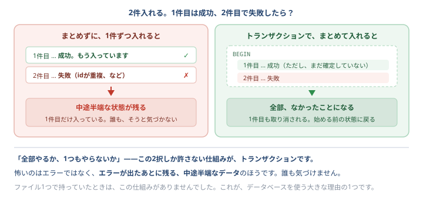

**怖いのはエラーそのものではなく、エラーのあとに残る中途半端なデータ**のほうです。

---

## AI まわり

### Claude Code

VS Code の中で使えるAI。相談したり、コードを書いてもらったりできます。

### 承認（しょうにん）

AIがファイルを書き換える前に、**あなたに許可を求めること**。差分を見て「はい」か「いいえ」を選びます。

### 権限モード

AIがどこまで勝手にやってよいかの設定。研修では**毎回確認する設定（Manual）**を使います。

→ [AIと一緒に直す](ai.html ':ignore target=_blank')

### CLAUDE.md（クロード・ドット・エムディー）

フォルダの中に置いておくと、**Claude Code が毎回いちばん最初に読んでくれるファイル**。「何を作っているか」「守ってほしいこと」を書いておくと、毎回説明し直さずに済みます。**ファイル名は全部大文字**です。

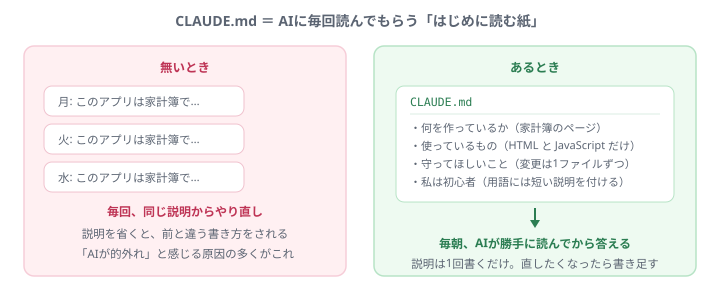

→ [自分のテーマで回す](theme.html ':ignore target=_blank')

### /clear（クリア）

Claude Code の**会話をリセットする**命令。ファイルは何も消えません。会話が長くなると的外れになりやすいので、**一区切りついたら切る**のが上手な使い方です。

### プロンプト

AIへの頼みごとの文章のこと。「〇〇して」と入力する、その文章です。

→ もっと詳しく: [AIはなぜ間違えるのか](why-ai-mistakes.md)

### MCP（エムシーピー）

**AIに、外の道具を使わせるための共通の約束ごと**。GitHub をつなぐと、差分を貼らなくても「PR #12 をレビューして」で通じるようになります。

**AIが賢くなるのではなく、手が届く範囲が広がるだけ**です。そして**渡した鍵の範囲でしか動けません**。

→ [AIに道具を持たせる（MCP × GitHub）](mcp.html ':ignore target=_blank')

### トークン（2つの意味があります）

**この言葉は、まったく別の2つのものを指します。混同しやすいので注意してください。**

| | 何のことか | どこで出てくるか |
| --- | --- | --- |
| **AIのトークン** | 文章を細かく区切った**単位**。日本語で1〜2文字ぶん。料金と上限がこれで数えられます | Claude の話をするとき |
| **GitHubのトークン** | **パスワードの代わりになる鍵**（`github_pat_` で始まる文字列） | MCP でつなぐとき |

**危ないのは後者です。** 見せてしまったら、隠さず**すぐ無効化（Revoke）**してください。作り直せば済みます。

### コンテキストウィンドウ

AIが**一度の会話で覚えていられる量**。ここを超えると、**古い部分から忘れていきます**。

会話が長くなると的外れになるのは、これが原因のひとつです。対策は2つ —— **`/clear` で切り直す**、**`CLAUDE.md` に前提を書いておく**（毎回自動で読まれるので、忘れられません）。

---

## AWS まわり（設定のときだけ出てきます）

### Bedrock（ベッドロック）

会社のAWS経由でAIを使うための仕組み。個人のアカウントではなく、会社の契約で使うため、この形になっています。

### APIキー

AIに接続するための**パスワードのようなもの**。担当者から配布され、設定ファイルに1回だけ書きます。

**絶対に他人に見せないでください。** チャットやSNSに貼らない、GitHubに上げない。もし見せてしまったら、隠さずすぐに連絡してください（キーを無効にして作り直せます）。
