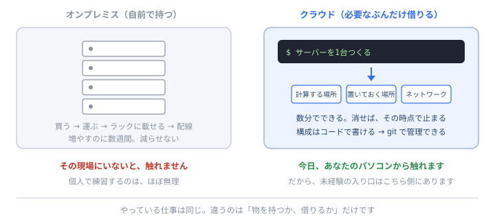

# インフラの世界と、その入り口

「インフラエンジニアになりたいけど、この研修だとなれる気がしない」 
——<b>そう感じるのは、当然です。</b>この教材には、サーバーもネットワークも出てきません。 
でも、<b>入り口は思っているより近いところにあります</b>。作業はありません。読むだけです。

## まず、世界が2つあることを知ってください

インフラの仕事は、**どこで動かすか**で大きく2つに分かれます。

| | **オンプレミス（自前）** | **クラウド（借りる）** |
| --- | --- | --- |
| 置き場所 | **自社やデータセンターの、物理的な機械** | 相手の会社の巨大な設備 |
| 用意する | サーバーを**買って、運んで、ラックに載せて、配線する** | **コマンド1つで作る** |
| 増やす | 発注して、届くのを待つ（**数週間**） | **数分** |
| 減らす | 減らせない（買ってしまったので） | **消せば、その時点で止まる** |
| 触るもの | 物理の機械、ケーブル、電源、空調 | **画面とコマンドとコード** |
| 入るには | **その現場にいる必要がある** | **手元のパソコンから触れる** |

<strong>ここが、いちばん大事な違いです。</strong> 
オンプレの世界は、<b>その場所に行かないと練習できません</b>。個人が勝手に触ることもできません。 
クラウドは、<b>今日、あなたのパソコンから触れます。</b>——<b>だから、クラウドならチャンスがあります。</b>

## なぜ「クラウドならチャンス」なのか

理由は4つあります。

**① 手元で試せる**
アカウントを作れば、その日から本物を触れます。**練習に、会社の許可も、機材も要りません。**

**② 論理の理解が主になる**
物理の配線ではなく、「**どこに何を置いて、どうつなぐか**」という**組み立ての理解**が中心です。
そして——**それは、あなたがこの研修でずっとやってきた考え方です。**

**③ コードで書ける**
クラウドの構成は、**設定ファイルとして書けます**。つまり **git で管理でき、レビューでき、履歴が残ります。**
<b>あなたがすでにできることが、そのまま効きます。</b>

**④ 体系がはっきりしている**
学ぶ順番と範囲が、**資格として整理されています**（後述）。独学の遠回りが少ない領域です。

<b>オンプレが古い、という話ではありません。</b> いまも大量にありますし、そこにしかない仕事もあります。 
ただ<b>「未経験から入る入り口」としては、圧倒的にクラウドのほうが開いている</b>——それだけの話です。

## おすすめは AWS

クラウドはいくつかありますが、**最初に触るなら AWS** をすすめます。理由は、この教材が VS Code をすすめる理由とまったく同じです。

機能が一番いいから？

<b>いいえ。使っている会社と人が、いちばん多いからです。</b> 
案件の数が多く、日本語の情報も多く、詰まったときに答えが見つかります。<b>初心者にとって「情報の多さ」は、機能の良さより価値があります。</b>——<a href="#/why-vscode">なぜ VS Code なのか</a>で書いたのと、同じ理屈です。

他のクラウドは覚え直しになりませんか？

<b>ほとんどなりません。</b>名前が違うだけで、<b>やっていることは同じ</b>だからです。「計算する場所」「置いておく場所」「ネットワーク」「権限」——どのクラウドにもあります。 
<b>1つを論理として理解すれば、2つ目は驚くほど速い</b>です。これも、この研修が言い続けてきた「土台が先」と同じ話です。

## 資格は、取る価値があります（ただし順番に注意）

**AWS には認定資格があります。** そして、インフラ領域では**資格が実際に効きます。**

この教材は「資格より手を動かせ」と言っていませんでしたか？

<b>言いました。そして、その姿勢は変えていません。</b> 
ただしインフラは事情が少し違います。<b>未経験者が実務経験を作りにくい領域</b>だからです。開発なら「作って公開する」ができますが、インフラは「任せてもらう」までが遠い。 
<b>だから資格が、入り口の代わりになります。</b>「この人は、少なくとも用語と全体像を知っている」と示せる。<b>それだけで、任せてもらえる範囲が変わります。</b>

**順番はこうです。**

| | 資格 | 位置づけ |
| --- | --- | --- |
| 1 | **クラウドプラクティショナー**（CLF） | **入門**。用語と全体像。ここから |
| 2 | **ソリューションアーキテクト アソシエイト**（SAA） | **実務の入り口として、いちばん評価されます** |
| 3 | その先（専門分野別） | 必要になってから |

<strong>ただし——資格は「地図」であって「切符」ではありません。</strong> 
持っていると<b>話が早くなる</b>し、<b>知らない言葉が減る</b>。でも、それだけで仕事ができるわけではありません。 
<b>必ず、手を動かしながら取ってください。</b>無料枠で1つ作って壊す。それだけで、暗記が理解に変わります。

⚠️ <b>お金の注意だけ、先に。</b> クラウドは<b>使った分だけ課金されます</b>。無料枠もありますが、<b>消し忘れると請求が来ます</b>。 
練習するときは、<b>①作ったら必ず消す ②請求のアラートを最初に設定する</b>——この2つを、いちばん最初にやってください。<b>これはインフラの仕事そのもの</b>でもあります。

## バックエンドから、あとで移れます

<b>いま決めなくて構いません。</b>そして、<b>いきなりインフラを目指さなくても、たどり着けます。</b>

これは現場でいちばん多い道です。

1. **バックエンドとして案件に入る**
2. 作ったものを**デプロイする**（＝動く場所に置く）。ここで**必ずクラウドを触ります**
3. 「デプロイが遅い」「落ちたとき戻せない」と困る → **自分で直す**
4. 監視、ログ、自動化と、**触る範囲がじわじわ広がる**
5. 気づけば、**インフラ寄りの人**になっている

<strong>「インフラの仕事」は、開発の仕事と地続きです。</strong> 
壁があるように見えるのは、外から見ているときだけ。<b>中に入ると、境目はかなり曖昧です。</b> 
だから——<b>そんなに心配しないでください。</b>まず入って、触れる範囲を少しずつ広げれば、届きます。

## あなたは、もうインフラの仕事を1つやっています

気づいていないかもしれませんが、**この研修の中で、すでにやっています。**

| 研修でやったこと | インフラの言葉でいうと |
| --- | --- |
| [世界に公開する](publish.html ':ignore target=_blank')（GitHub Pages） | **デプロイ**。作ったものを、動く場所に置く |
| Live Server で開く | **サーバーを立てる**（自分のPCを一時的にサーバーにする） |
| [問題の切り分け](api.html ':ignore target=_blank')（Console と Network） | **どの層で壊れているかの切り分け**。運用の基本動作です |
| 自動チェック（GitHub Actions） | **CI**。決めた手順を、機械に毎回やらせる |
| `git bisect` の終了コード | **自動化が噛み合う仕組み**（[観測する力](observe.html ':ignore target=_blank')） |
| コンフリクトを解決して取り込む | **変更を安全に反映する**。本番作業と同じ考え方 |

<strong>つまり、あなたに足りないのは「経験」ではなく「言葉」と「規模」です。</strong> 
やっていることの本質は、もう触れています。<b>ゼロからではありません。</b>

## 明日からできること（お金をかけずに）

**大きなことをしなくて構いません。**

- **[世界に公開する](publish.html ':ignore target=_blank')をもう一度読む。** あれがデプロイだった、という目で
- **AWS のアカウントを作って、請求アラートだけ設定する**（作るだけで勉強になります）
- **クラウドプラクティショナーの出題範囲を眺める。** 知らない言葉に印を付けるだけでいい
- **[逆算プランナー](plan.md)で「目指す方向: インフラ・クラウド」を選び、「マッチ度を測る」を押す**
  → **いま持っているもののうち、何が通用するか**が出ます

そして、この教材が扱うのは<b>ここまで</b>です。AWS の使い方そのものは教えません（<a href="#/path">理由</a>）。 
<b>でも、土台と入り口は渡しました。</b>ここから先は、<b>手を動かしながら、必要になった順に</b>——この研修でずっとやってきたやり方が、そのまま使えます。

## まとめ

- インフラには**オンプレ**と**クラウド**の2つの世界がある
- **未経験の入り口として開いているのは、圧倒的にクラウド**。手元から触れるから
- **おすすめは AWS**。理由は「情報が多いから」——VS Code と同じ
- **資格は取る価値がある**（CLF → SAA）。ただし**地図であって切符ではない**。手を動かしながら
- **バックエンドから移る道が、いちばん多い。** デプロイで触り、少しずつ広げる
- **あなたはもう、小さなインフラの仕事を1つ終えています**（GitHub Pages への公開）

---

寄り道はここまでです。おつかれさまでした。

- 👉 職種の全体像 → [どこへ行く？ 職種と、共通の土台](path.md)
- 通用するものを測る → [逆算プランナー](plan.md)
- もう一度読む → [世界に公開する](publish.html ':ignore target=_blank')
- 全体を見る → [トップページ](/)
