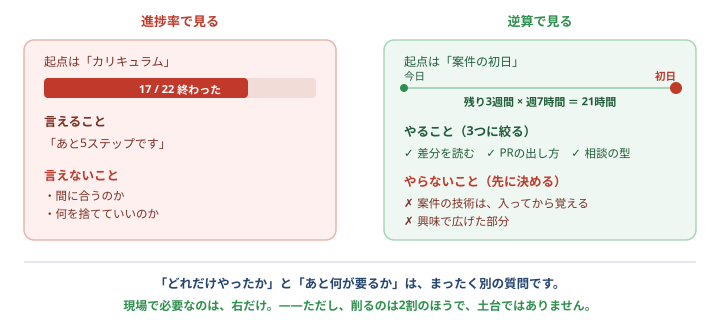

# 教える人へ — 逆算できていますか

このページは、<b>研修の担当者・メンター・講師</b>のためのものです。 
研修生が読んでも構いません。むしろ<b>読んでほしい</b>です——<b>一人で学んでいる人は、自分がメンターだから</b>です。

<strong>この教材のゴールは「22ステップの完走」ではありません。</strong> 
<b>案件に入って、通用すること</b>です。<b>地図は手段で、ゴールではありません。</b>

## いちばん多い失敗

**カリキュラムを終わらせること自体が、目的になることです。**

これは悪意なく起きます。地図があり、進捗が出て、チェックが付く。**進んでいる実感があるからです。** そして——

22ステップ全部終わりました。準備できましたか？

<b>それだけでは分かりません。</b>案件が<b>3日後</b>なら、90%終わっていても間に合いません。案件が<b>3か月後</b>なら、40%でも余裕です。 <b>「どれだけやったか」と「あと何が要るか」は、まったく別の質問です。</b>

**前者を測るのが進捗率、後者を出すのが逆算です。** そして——**現場で必要なのは、後者だけです。**

## 進捗率で見ると、何が起きるか

| 進捗率で見ると | 逆算で見ると |
| --- | --- |
| 「あと5ステップ」 | 「**あと3週間で、この案件に必要なのは3つ**」 |
| 遅れ＝サボり | 遅れ＝**計画が現実に合っていなかった**という情報 |
| 全部やらせようとする | **捨てるものを一緒に決める** |
| 終わったら合格 | **終わっていなくても、間に合うなら送り出す** |
| 本人が不安なまま進む | **「いつまでに、何が」が見えて、不安がやることに変わる** |

<b>進捗率がいけないのではありません。</b> 便利ですし、この教材にも地図があります。 
ただ<b>それだけを見ていると、「間に合うかどうか」が一度も話題に上りません。</b>——そこが問題です。

## 毎週、3つだけ聞いてください

長い面談は要りません。**3つで足ります。**

**① いつ始まりますか？（まだなら、見込みは？）**
これが無いと、逆算が始まりません。**未定なら「未定」と確定させてください。** 未定は、それ自体が重要な情報です。

**② 先週、実際に何時間とれましたか？**
「とれる予定の時間」ではなく **「実際の時間」** を聞いてください。ここがズレたまま計画を立てると、**必ず3週目で折れます。**

**③ いま、いちばん自信が無いのはどこですか？**
本人が答えられなければ、[🎓 最終チェック](graduation.md)を一緒に開いてください。**チェックが付かない項目が、そのまま答えです。**

<strong>この3つが揃えば、逆算プランナーがそのまま計画を出します。</strong> 
→ <a href="#/plan">案件まで1か月。何をする？</a>　メンターが横で一緒に押すのがいちばん効きます。

## 捨てさせてください

**これが、いちばん教える側にしかできない仕事です。**

研修生は、自分から「やめます」と言えません。**言えば怒られる、と思っているからです。** だから、**教える側が先に言う**必要があります。

「全部やらせたほうが、力が付くのでは？」

<b>時間が足りているなら、そうです。</b>足りていないなら逆になります。 全部に手を出した人は、<b>どれも中途半端なまま初日を迎えます</b>。3つに絞った人は、<b>3つは確実に使えます</b>。<b>初日に効くのは後者です。</b>

**具体的には、こう言ってあげてください。**

> 「**残り3週間で、週7時間。21時間しかありません。**
> 　だから、〇〇と△△はやりません。**参画してから、仕事の中で覚えます。**
> 　その代わり、□□だけは確実に終わらせましょう」

<b>「捨てていい」と言われた瞬間に、表情が変わる人がいます。</b>ずっと、全部やらなければいけないと思っていたからです。 
<b>捨てる判断は、案件でも毎日やります。</b>ここで一度経験させておくことに、それ自体の価値があります。

## ただし、土台は削らせないでください

<strong>「捨てる」の対象は、案件ごとに入れ替わる2割です。土台ではありません。</strong>

急いでいる研修生ほど、こう言い出します。「**gitの基本は飛ばして、いきなり案件の技術をやりたいです**」。

時間が無いなら、案件で使う技術を優先すべきでは？

<b>逆です。土台を飛ばした人は、案件の技術も身につきません。</b> 
記録が残せない・戻せない・差分が読めない・質問ができない状態で新しい技術を触ると、<b>「動いた」以上のことが分からないまま進みます</b>。そして<b>壊したときに、何も残りません</b>。 
<b>土台は10年使えて、2割は3年で入れ替わります。</b>削るなら2割のほうです（<a href="#/path">くわしく</a>）。

**削っていい順番を、こちらから示してあげてください。**

| | 判断 |
| --- | --- |
| **絶対に削らない** | git / 差分を読む / プルリクエスト / 質問と報告 |
| 削っていい | 任意ステップ、読み物、興味で広げた部分 |
| **参画後に回す** | 案件固有のフレームワーク、クラウド、言語の細部 |

## やってはいけない5つ

| | なぜ |
| --- | --- |
| **進捗率だけで評価する** | 「間に合うか」が一度も話題に上らなくなります |
| **全ステップの完走を、参画の条件にする** | ゴールが入れ替わります。**条件は「案件で通用するか」**です |
| **「頑張れば間に合う」と言う** | 頑張りは工数ではありません。**計算して、足りないなら足りないと言ってください** |
| **自分が通った道を、そのまま押し付ける** | あなたの残り時間と、その人の残り時間は違います |
| **急いでいるからと、土台を飛ばさせる** | いちばん取り返しがつきません。**削るのは2割のほう**です |
| **0円ルートを下に見る** | 学ぶ内容は同じです。<b>お金の有無で扱いを変えないでください</b>（[理由](alone.md)） |

<strong>とくに3つ目です。</strong> 
「頑張れば間に合う」と言った瞬間、<b>間に合わなかったときの責任が、本人だけに乗ります。</b> 
<b>計算して、足りないと分かっているなら、先に言ってください。</b>それが逆算するということです。

## この教材が教えないこと（＝あなたが埋める部分）

**この教材は、土台までしか扱いません**（[理由](path.md)）。次の3つは、**教材では埋まりません。**

**① 職種ごとの「2割」** — SQL、Go、React、AWS。**案件が決まってから、実物で覚えるのがいちばん速い**ので、教材では扱っていません。ここは案件と、あなたの案内が担当です。

**② 案件固有のルール** — ブランチの切り方、PRの粒度、レビューの回し方、AIの使用範囲。**チームごとに違います。** [最終チェック](graduation.md)にも「初日に確認する」としか書けません。**先に教えてあげられるのは、あなただけです。**

**③ 人と、場の事情** — 誰に聞けばいいか、何曜日が忙しいか、どこまでが自分の裁量か。**これが分からないと、技術があっても動けません。**

## 一緒に使える道具

| 道具 | 何が出るか |
| --- | --- |
| [🎓 最終チェック](graduation.md) | **できていない項目**が一覧でコピーできます。面談の材料になります |
| [🗓️ 逆算プランナー](plan.md) | 残り時間と弱点から、**週ごとの計画**をAIに作らせます |
| 同・**マッチ度を測る** | **案件の技術と、身につけたものを突き合わせます**。「何が通用するか」が出ます |
| 地図の**進捗をコピー** | 本人がそのまま送れます。**催促しなくて済みます** |

<b>報告のために新しい仕組みを作らないでください。</b> LINEでもチャットでも、<b>いつも使っている手段</b>で構いません。 
<b>報告の手間を増やすと、報告が来なくなります。</b>——そして<b>来なくなった報告は、遅れの発見を遅らせます。</b>

## 一人で学んでいる人へ

**あなたには、この役をやってくれる人がいません。** だから、**自分でやってください。**

**週に1回、自分に3つ聞くだけ**です。

1. **いつまでに、どこへ行きたいか**（決まっていないなら、仮でいい。「3か月後に応募する」でも）
2. **先週、実際に何時間やれたか**（予定ではなく実績）
3. **いま、いちばん自信が無いのはどこか**

そして——**遅れていたら、自分に「捨てていい」と言ってあげてください。** 誰も言ってくれないので、自分で言うしかありません。

<strong>これができる人は、案件に入っても強いです。</strong> 
<b>自分の進み具合を、自分で管理できる</b>——それは、多くの経験者ができていないことです。

## 最後に、あなた自身への1問

<b>「この人を、いつまでに、どこまで持っていくのか」</b>を、いま言えますか。

**言えないなら、それを決めるのが最初の仕事です。** 研修生に聞く前に、決めてください。

<b>そして、決めたら本人に伝えてください。</b> ゴールを知らされていない人は、逆算のしようがありません。 
「<b>3か月後に、この規模の案件に入れる状態にします</b>」——これが伝わっているかどうかで、同じカリキュラムの効き方がまったく変わります。

---

- 全体の思想 → [この教材について（無料である理由）](about.md)
- 職種と、教材の守備範囲 → [どこへ行く？ 職種と、共通の土台](path.md)
- 逆算する → [案件まで1か月。何をする？](plan.md)
- 全体を見る → [トップページ](/)
