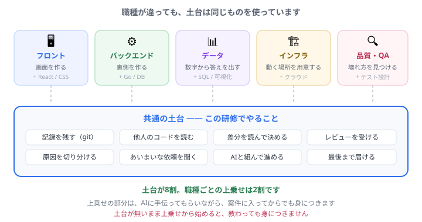

# どこへ行く？ — 職種と、共通の土台

「バックエンドをやりたいので、まず Go と DB から始めます」 
「データアナリストになりたいので、統計の本を買いました」 
——<b>どちらも、順番が逆になっています。</b>このページは、その理由と、正しい順番の話です。

## 先に結論

**職種ごとの違いは、2割です。** 残り8割は、フロントでもバックでもデータでも**まったく同じもの**を使っています。

そして**その8割が、この研修でやっていること**です。

## なぜ「いきなり Go や DB」で止まるのか

Go を勉強するのが、なぜ遠回りになるんですか？

Go そのものが悪いのではありません。<b>Go を書いても、それを動かす・記録する・直す・届ける手段が無い</b>からです。 本を1冊読んでも、<b>手元に残るのは書き写したファイル1つ</b>です。git が無いので履歴も残らず、直したら前の状態に戻れず、人に見せる形にもなりません。<b>「勉強した」という記憶だけが残ります。</b>

土台からやると、遠回りに感じます

逆です。<b>土台がある人は、Go を1週間で「使える」ところまで持っていけます。</b>作って、動かして、壊して、戻して、AIに聞いて、直せるからです。 土台が無い人は、同じ1週間で「写経した」だけで終わります。<b>差がつくのは言語の知識ではなく、回せる速さです。</b>

<b>興味を消す必要はありません。</b> Go が好きなら、この研修の「自分のテーマで回す」を Go でやっても構いません。<b>順番の話をしているだけ</b>です。土台の上でやれば、同じ勉強が何倍も残ります。

## 職種ごとの「2割」

どれも<b>いま決める必要はありません。</b> 研修を終えてから、案件を見ながら決めても遅くありません。むしろ、<b>手を動かす前に決めたものは、だいたい変わります。</b>

### 🖥️ フロントエンド — 目に見える部分を作る

- **やること**: 画面、操作したときの動き、見た目、使いやすさ
- **上乗せ**: CSS をもう少し／React などの道具／ブラウザの仕組み
- **この研修との距離**: **いちばん近い**。「はじめてのプログラム」と「仕事の一周」が、そのまま入口です
- **向いている人**: 作ったものがすぐ目に見えるほうが、やる気が続く人

### ⚙️ バックエンド — 裏側の判断とデータ

- **やること**: 「この人は誰か」「これを保存してよいか」を判断する部分、データの出し入れ
- **上乗せ**: サーバーの言語（Go / Python / TypeScript など）／SQL とデータベース／APIの設計
- **この研修との距離**: 「サービスって何？」で読んだ**②の部分**です。土台の上に足すのは、意外と少ないです
- **向いている人**: 仕組みを整理したり、正しさを詰めるのが好きな人

### 📊 データ — 数字から答えを出す

- **やること**: 「なぜ売上が落ちたか」を数字で説明する、集計、可視化、意思決定の材料づくり
- **上乗せ**: **SQL**（これが主役）／表計算／グラフの作り方／統計の基礎／扱う分野の知識
- **この研修との距離**: 遠そうに見えて、**意外と近いです**（下で例に使います）
- **向いている人**: 「なぜそうなっているのか」を突き止めるのが好きな人

<b>入口について、正直に書いておきます。</b> 「データアナリスト」という肩書きの仕事は、<b>その事業を持っている会社の中にあることがほとんど</b>です。数字から示唆を出す仕事は、事業を知らないとできず、外から請けにくいからです。 
そのため、<b>参画できる案件として出てくるのは、分析そのものより「データ基盤を作る・整える」側</b>——データエンジニアに近い仕事になります。<b>これは遠回りではありません。</b>データがどう作られているかを知っている人の分析は強いので、<b>そこから分析側へ移る</b>のが、現実にいちばん多いルートです。 
<b>肩書きから入らず、データに触れる場所に立つ。</b>順番はこちらです。

### 🏗️ インフラ・クラウド — 動く場所を用意する

- **やること**: 動かす環境、公開、監視、落ちたときの復旧
- **上乗せ**: クラウド（AWS など）／Linux の操作／自動化
- **この研修との距離**: 「世界に公開する」でやった **GitHub Pages への公開**が、いちばん小さいインフラの仕事です
- **向いている人**: 止まらない仕組みを作るのが好きな人、地味な作業を苦にしない人
- 👉 **「なれる気がしない」と思ったら** → [インフラの世界と、その入り口](infra.md)（オンプレとクラウド、AWS、資格、バックエンドから移る道）

### 🔍 品質・QA — 壊れ方を見つける

- **やること**: 仕様どおり動くかの確認、壊れ方の想定、自動テスト
- **上乗せ**: テストの設計／自動テストの書き方
- **この研修との距離**: 「仕事の一周」の**受け入れ条件（テスト）**が、そのままこの仕事です
- **向いている人**: 「こうしたら壊れるのでは？」が自然に浮かぶ人

---

## 例: 「エンジニアの研修は関係ない」と思う職種でも

上の5つのうち、この研修からいちばん遠そうに見えるのは **📊 データ** でしょう。
実際にどうなるか、具体的に並べてみます。

| データの仕事で起きること | 土台があると |
| --- | --- |
| 「先月と同じ集計をもう一度」と言われる | **git に残っているので再現できる**。無い人は毎回作り直します |
| 集計の条件を1か所変えたら、結果が変わった | **差分を見れば、何を変えたか分かる** |
| 「この数字、どうやって出したの？」と聞かれる | **PR の説明と履歴が、そのまま答えになる** |
| 分析用のコードを他の人が引き継ぐ | **読める形で置いてある。渡せる** |
| 依頼が「なんかいい感じに分析して」 | **質問して要件を詰める**（[仕事の一周](work.html ':ignore target=_blank')でやりました） |

<strong>「一度きりの作業」から「仕事」に変わる境目が、ここです。</strong> 手作業でやり直している人と、<b>再現できる形で残せる人</b>の差は、年々開いていきます。 
そしてこれは、データに限った話ではありません。<b>5つの職種すべてで同じこと</b>が起きます。

## この教材が教えるのは、土台までです

<b>職種ごとの「2割」は、ここでは教えません。</b> SQL も、Go も、React も、AWS も扱いません。 
理由は2つです。<b>①その2割は、案件が決まってから覚えるほうが速い</b>（使う場面があるので残ります）。<b>②中途半端に教えると、かえって遠回りになる</b>からです。

**では、2割はどこで身につけるのか。** 3つあります。

1. **案件の中で**。いちばん速く、いちばん確実です。給料をもらいながら覚えられます
2. **[自分のテーマで回す](theme.html ':ignore target=_blank')で**。この研修の10番目は、題材が自由です。**Go でも SQL でも、そこでやって構いません**
3. **[案件まで1か月。何をする？](plan.md)で**。案件の内容から逆算して、何をどの順で触るかを組み立てられます

<strong>この教材が守っているのは、順番だけです。</strong> 何を学ぶかは、あなたと案件が決めます。 
「土台をやってから」と言い続けているのは、<b>そのほうが、あとの2割が速く身につくから</b>——それ以上の意味はありません。

## 迷っている人へ: 決めなくていい理由

やりたい職種が決まっていません。不利ですか？

<b>不利ではありません。</b>むしろ、土台をやっている間に「どれが面白いか」が分かってきます。 実際、<b>最初の案件で担当した領域が、そのままキャリアになる人がとても多い</b>です。先に決め打ちするより、<b>入れる案件に入って、そこで伸ばす</b>ほうが現実的です。

途中で変えたくなったら？

<b>変えられます。</b>土台の8割は共通なので、乗り換えのコストは思っているより小さいです。フロントからデータへ、データからバックへ——現場では普通に起きています。 <b>失われるのは2割だけ</b>です。

## 次にやること

- **まだ研修の途中の人** → 順番どおり進めてください。**このページのことは忘れて構いません**
- **研修を終えた人** → [案件まで1か月。何をする？](plan.md)で、**逆算した学習計画**を作れます
- **もう案件が決まっている人** → 同じく[逆算プランナー](plan.md)へ。**案件の内容から、やることを決めます**

---

- 全体を見る → [トップページ](/)
- 言葉の意味 → [用語集](glossary.md)
