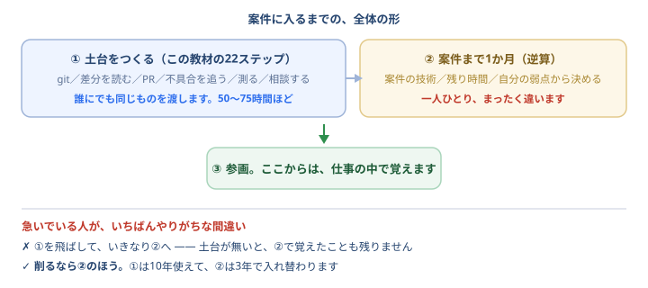

# 案件まで1か月。何をする？

<div class="lead">
<b>ここからが本番です。</b><br>
地図の22ステップで作ったのは<b>「土台」</b>——誰にでも同じものを渡す、いちばん長く使う部分です。<br>
でも案件は、<b>一人ひとり違います</b>。使う技術も、残り時間も、いま足りないものも。<br>
<b>その差を埋めるのが、この1か月です。</b>そして埋め方は、あなたの条件でしか決まりません。
</div>

<div class="note">
🧱 <b>「土台だけでは足りない」＝「土台は大したことない」ではありません。</b><br>
この1か月で足すのは、<b>案件ごとに入れ替わる部分</b>です。<b>土台のほうが、長く使えます。</b><br>
実際この計画も、<b>土台があるから立てられます</b>——「テストは書ける」「切り分けはできる」が分かっているから、<b>何を足せばいいかが決まる</b>のです（<a href="#/path">なぜ土台が先なのか</a>）。
</div>



<div class="checkpoint">
<strong>「地図を全部埋めたから、準備できた」ではありません。</strong><br>
土台（50〜75時間）＋ <b>案件に合わせて逆算する1か月</b>。<b>この2つで、ようやく1セット</b>です。<br>
<b>足りないのは、あなたの努力ではなく、まだ逆算していないこと</b>だけかもしれません。
</div>

## 逆算プランナー

<div id="planner">読み込み中…</div>

<div class="note">
ボタンを押すと、<b>そのままAIに貼れる文章</b>がコピーされます。Claude Code でも、ブラウザの Claude でも構いません。<br>
<b>入力は保存されます。</b>毎週開き直して、少しずつ直しながら使ってください。
</div>

<div class="checkpoint">
<strong>「まだ自信が無いところ」を、必ず埋めてください。</strong> ここが空だと、AIは<b>一般的な計画</b>しか作れません。<br>
<a href="#/graduation">🎓 案件に入る前の最終チェック</a> の下にある <b>「できていない項目をコピー」</b>を押すと、
チェックが付いていない項目がそのままコピーされます。<b>それを貼るだけです。</b>
</div>

## ボタンは3つあります

| ボタン | 何が作られるか | いつ使うか |
| --- | --- | --- |
| **学習計画の依頼** | 週ごとの計画をAIに作らせる文章 | **最初に**。計画を立てるとき |
| **案件とのマッチ度を測る** | **研修で身につけたものと、案件で必要なものを突き合わせる**文章 | 案件の内容が分かったとき |
| **毎週の振り返り用** | 進み具合を伝えて、計画を調整させる文章 | **毎週末に**。必ず作り直す |

<div class="checkpoint">
<strong>案件の技術が「聞いたこともないもの」でも、まず「マッチ度を測る」を押してください。</strong><br>
<b>この研修で手を動かしたことが、そのまま一覧になって入ります。</b>そのうえで、<br>
<b>①そのまま通用するもの ②形を変えれば通用するもの ③足りないもの（優先度順）④全体のマッチ度</b>を、AIに判定させます。
</div>

## どんな計画が返ってくるのか（見本）

<div class="note">
<b>これは、ある1人の状況で作った見本です。</b>あなたの計画は、必ず違うものになります。<br>
見てほしいのは<b>中身ではなく「形」</b>です。<b>この形になっていれば、良い計画</b>だと思ってください。
</div>

<details>
<summary><b>見本を開く</b>（バックエンド案件・開始まで5週間・週7時間の人の場合）</summary>

**入力した条件**

| 項目 | 入れたもの |
| --- | --- |
| 開始まで | 29日（約5週間）＝ 合計およそ35時間 |
| 週の時間 | 週7時間（1日1時間） |
| 到達度 | 16「修行」まで終わった |
| 案件 | バックエンド。TypeScript / Node.js / AWS / NestJS。週32〜40時間稼働 |

---

### 現在地と、案件の距離

**そのまま通用するもの**: git / GitHub / PR / レビュー / テスト / 切り分け / 報連相 / 見積り。**言語が変わっても1文字も変わりません。**

**足りないもの（優先度順）**

| | 足りないもの | なぜ必要か |
| --- | --- | --- |
| 1 | TypeScript が読めない | コードが読めない＝何も始まらない。**最優先** |
| 2 | サーバーを書いたことがない | ブラウザのJSしか書いていない |
| 3 | DBとSQLを見たことがない | バックエンドの仕事の半分 |
| 4 | NestJS を知らない | **現場のコードを真似るのが最速** |
| 5 | AWS を知らない | 案件ごとに違う。権限も要る |

### 参画前 / 参画後 の切り分け（計画の骨）

週32〜40時間稼働＝**参画後の1か月で128〜160時間**。いま使える35時間の**4倍以上**です。

| | 内容 |
| --- | --- |
| **参画前にやる**（35時間） | TypeScriptを**読める**／サーバーが動く仕組み／DBとSQLの基本／NestJSの構造を**読める** |
| **参画後に、仕事で覚える** | NestJSの作法／AWSの具体／設計思想／CI/CD／チームの独自ルール |

**4と5を参画前に入れません。** 入れると1〜3が終わりません。

### 5週間の計画

**平日5日 × 1時間。土日は休みます。** 飛ばした日を取り返そうとしないこと。

| 週 | ゴール（1つだけ） | 手を動かすこと | 終わった判断 |
| --- | --- | --- | --- |
| **1** | TypeScript が読める | 既存の `logic.js` を `.ts` にして型を付ける。**わざと間違えてエラーを出す** | `tsc --noEmit` が通り、間違えると赤くなる |
| **2** | サーバーを自分で立てる | `node:http` **だけ**でJSONを返す。404と500も自分で返す | ブラウザでJSONが出て、`/nope` で404 |
| **3** | データを保存する | SQLiteでテーブルを作り、SQLを手で打つ。サーバーをDB読みに変える | **再起動してもデータが残る** |
| **4** | NestJS の構造を読む | ひな形を作り、第2週の自作サーバーと**対応づける** | Controller/Service/Module の担当を言える |
| **5** | 仕上げ（新しいことをしない） | READMEを書く。AWSは**請求アラートだけ**。初日に聞くこと整理 | 「これを作りました」とURL付きで言える |

<div class="checkpoint">
<strong>第2週でフレームワークを使わないのが肝です。</strong> ここを飛ばすと、NestJS が魔法に見えます。<br>
<b>第4週は「覚える」ではなく「読めるようにする」だけ。</b>暗記しません。
</div>

### 明日、いちばん最初にやること

**`logic.js` をコピーして、`Task` 型を1つだけ自分の手で書く。**

```ts
type Task = { id: number; title: string; due: string | null; done: boolean };
```

**30分で終わります。AIに頼まず、自分で書く。**

### 捨てるもの

| 捨てるもの | 理由 |
| --- | --- |
| AWSの学習（アラート除く） | 権限が無いと触れない。**参画後に実物で** |
| NestJSのDI・Guard・Pipe | 先に読んでも定着しない。現場を真似るのが速い |
| Docker | 手順書に従えば動く。詰まったときに |
| TypeScriptの高度な型 | **読めれば十分**。書くのは業務で |
| 設計思想（コンパウンド構成） | 中に入らないと意味が分からない |

### 初日に聞くこと

1. **READMEどおりに動きますか？** 動かないなら、それが最初の仕事でいいですか
2. AWSの権限は誰に、いつ頼めばいいですか
3. TypeScriptは strict ですか。`any` はどこまで許されますか
4. どのブランチから切り、PRはどの粒度で出しますか
5. レビューは誰が、どのくらいで返してくれますか
6. テストはどこまで求められますか
7. **どこを触ると、どこに影響しますか**（構成の境界）
8. 詰まったとき、誰に、どう聞くのが良いですか

### 危ないサイン

1. **週の後半に「今週まだ手を動かしていない」** → その週のゴールを**半分に削る**
2. **読む時間が、書く時間を超えた** → 明日は1行でも書いてから読む
3. **3日以上、同じところで詰まっている** → 15分ルールが守れていない。**いま出す**

### この時間で足りるか（正直な評価）

| 目標 | 35時間で |
| --- | --- |
| NestJSとAWSを**使えるようになる** | ❌ まったく届きません |
| TypeScript/Node/DBが**読めて、初日に詰まらない** | ⭕ 届きます |

**そしてそれでいい**、というのが結論です。参画後の1週間が、参画前の5週間より長いからです。
**参画前の35時間は「業務時間を1時間も無駄にしないための投資」**と考える。

**削るなら 第4週 → 第3週の後半 の順。第1週と第2週は絶対に捨てない**（初日にコードが読めなくなる）。

</details>

## 返ってきた計画を、自分で採点する

<div class="checkpoint">
<strong>AIの答えを、そのまま信じないでください。</strong> これは研修でずっと言ってきたことと同じです。<br>
次の<b>7つ</b>で採点してください。<b>△が3つ以上あれば、作り直させます。</b>
</div>

| | 見るところ | ✕ になっている例 |
| --- | --- | --- |
| 1 | **週のゴールが1つだけか** | 「TypeScriptとNode.jsとDBを学ぶ」← 3つ入っている |
| 2 | **手を動かす作業になっているか** | 「公式ドキュメントを読む」「動画を見る」← 読むだけ |
| 3 | **終わったと判断する方法があるか** | 「理解する」← 判定できません |
| 4 | **参画前と参画後が分かれているか** | 全部を参画前に詰め込んでいる |
| 5 | **捨てるものが具体的か** | 「優先度の低いもの」← 名指ししていない |
| 6 | **足りないなら足りないと言っているか** | 「頑張れば間に合います」← 根拠がない |
| 7 | **休む日が入っているか** | 毎日やる前提 ← 必ず折れます |

<div class="note">
<b>直させるときは、こう言ってください。</b><br>
「<b>3週目のゴールが2つ入っています。1つに絞ってください</b>」<br>
「<b>『ドキュメントを読む』は手を動かす作業ではありません。何を作るのかで書き直してください</b>」<br>
<b>指摘して直させる</b>——<a href="review.html" target="_blank" rel="noopener">レビューする側になる</a>でやったことが、そのまま使えます。
</div>

## 「マッチ度を測る」が、いちばん効く理由

<div class="qa">
<div class="q">案件の技術が、研修とまったく違います。無駄でしたか？</div>
<div class="a"><b>そう思ってしまうのが、いちばんもったいないところです。</b><br>
たとえば「フロントは React、裏は Java」の案件でも、<b>git も、プルリクエストも、レビューも、テストも、不具合の切り分けも、報連相も、まったく同じ</b>です。違うのは言語と道具だけ。<br>
<b>でも、それを自分で言葉にするのは難しい。</b>だからAIに突き合わせさせます。<b>「何が通用するか」が分かっていないと、初日に何も出せません。</b></div>
</div>

<div class="qa">
<div class="q">「足りないもの」ばかり出てきたら、落ち込みませんか？</div>
<div class="a"><b>そうならないよう、依頼文に条件を入れてあります。</b><br>
「<b>足りないものを並べて終わりにしないでください。通用するものを先に、具体的に挙げてください</b>」——この一行が入っています。<br>
そして足りないものは<b>5つまで</b>、<b>優先度順</b>で、<b>「研修のどの経験の延長で学べるか」つき</b>。<b>埋め方まで出させます。</b></div>
</div>

<div class="qa">
<div class="q">案件の内容が、まだ分かりません</div>
<div class="a"><b>空でも作れます。</b>その場合は「目指す方向」だけで判定します。<br>
ただし——<b>使っている技術の名前が1つ2つ分かるだけで、判定はかなり正確になります。</b>「React」「AWS」「Java」。それだけでも、案件の話を聞いたときにメモしておいてください。</div>
</div>

## この道具が、勝手にやっていること

<div class="qa">
<div class="q">到達度が、最初から選ばれているのはなぜ？</div>
<div class="a"><b>あなたの進捗を読んで、推定しています。</b>ナビをどこまで終えたかが、このブラウザに記録されているためです。<b>違っていたら、自分で選び直してください。</b>推定はあくまで初期値です。</div>
</div>

<div class="qa">
<div class="q">「時間が足りません」と出ました</div>
<div class="a"><b>正直に出しています。</b>到達度から見て必要な時間と、あなたが使える時間を比べただけです。<br>
そして——<b>これは、やめる理由ではありません。</b>足りないと分かっているなら、<b>何を捨てるかを先に決められます</b>。コピーされる文章には、その指示が自動で入ります。<br>
<b>いちばん悪いのは、足りないことに気づかないまま全部やろうとして、3週目で折れることです。</b></div>
</div>

<div class="qa">
<div class="q">「すでにできること」は、誰が書いているの？</div>
<div class="a"><b>到達度から自動で作られています。</b>そして最後にこう書き添えてあります——<b>「上に書いていないことは、まだできません。できる前提で計画を立てないでください」</b>。<br>
これが無いと、AIは<b>できる前提</b>で計画を作りがちです。「PRを出して」と書かれても、まだ出したことがなければ動けません。</div>
</div>

## なぜ、AIに作らせるのか

<div class="qa">
<div class="q">誰かが作った「1か月の学習ロードマップ」ではだめですか？</div>
<div class="a"><b>だいたい合いません。</b>あなたの残り時間・到達度・案件の内容が違うからです。<br>「1日3時間とれる人向け」の計画を、週3時間しかとれない人が使うと、<b>3週目で必ず折れます</b>。守れない計画は、無いのと同じです。</div>
</div>

<div class="qa">
<div class="q">AIの作った計画は信用できますか？</div>
<div class="a"><b>そのまま信じないでください。</b>これは研修でずっと言ってきたことと同じです。<b>読んで、おかしければ断る。</b><br>「この週は詰め込みすぎです」「これは今の私には早い」と伝えれば、AIは作り直します。<b>その往復が、あなたに合った計画を作ります。</b></div>
</div>

<div class="qa">
<div class="q">案件の内容が、まだよく分かりません</div>
<div class="a"><b>空のままで構いません。</b>残り時間と到達度だけでも、計画は作れます。<br>そして<b>「初日に聞くこと」も一緒に出させてください</b>。分からないまま不安でいるより、聞く準備をするほうが前に進みます。</div>
</div>

## 使い方のコツ

### 1週間ごとに、必ず作り直す

**計画は、立てた瞬間から古くなります。** 週末に「毎週の振り返り用」をコピーして、進み具合を伝えてください。

大事なのは、**遅れたときに減らすこと**です。遅れた計画をそのまま持ち続けると、ある日いきなり全部を投げ出します。

<div class="checkpoint">
<strong>「間に合わないなら、何を捨てるか」を先に決めておく。</strong> これは実際の案件でも、まったく同じことをします。<b>計画を守ることより、捨てる判断のほうが実務的です。</b>
</div>

### 「読むだけ」の計画にしない

生成される文章には、こう書いてあります。

> **本や動画を「見る」だけの計画にしないでください。** 毎週、手元で動くものが1つ増える形にしてください。

これは意図的に入れてあります。**本を3冊読んだ人より、小さいものを3つ作った人のほうが、案件では確実に動けます。**

### 案件の資料を、そのまま貼らない

<div class="note">
⚠️ <b>会社名・顧客名・個人名・URLは消してください。</b>そして<b>「案件の情報をAIに貼ってよいか」を、担当者に必ず確認</b>してください。チームごとにルールが違います。<br>
分野と規模（「社内向けの勤怠システム、5人、フロントは React」程度）だけでも、計画は十分に作れます。
</div>

これは[AIと一緒に直す](ai.html ':ignore target=_blank')でやった「AIに貼ってはいけないもの」の実地です。**案件が始まる前から、もう本番です。**

## 案件が始まってからの使い方

このプランナーは、**始まってからも使えます。**

- 「開始日」に**次の区切り**（1か月後の目標日など）を入れる
- 「案件の内容」に、**実際に担当している作業**を書く
- 毎週の振り返りで、**詰まっていることを正直に伝える**

**独立して仕事を受けるようになったときも同じです。** 納期から逆算して、週ごとに割って、毎週見直す。**やることは変わりません。**

---

- 教える立場の人へ → [教える人へ（逆算できていますか）](mentor.md)
- 行き先を決める → [どこへ行く？ 職種と共通の土台](path.md)
- 到達度を確かめる → [🎓 案件に入る前の最終チェック](graduation.md)
- 全体を見る → [トップページ](/)
