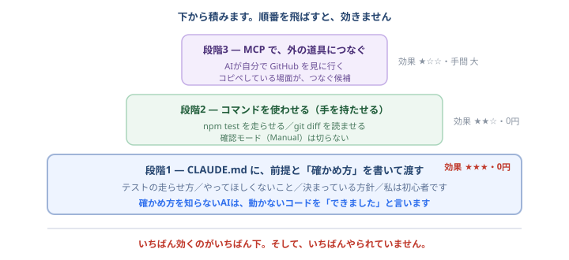

# Claude Code を賢くする — 目と手を増やす

<div class="lead">
AIが的外れになる原因は、たいてい<b>頭の悪さではなく、情報不足</b>です。<br>
「見えていない」「触れない」だけ。<b>だから、見えるものと、できることを増やします。</b><br>
効果が大きい順に3段階あります。<b>1つ目は今日からできて、0円です。</b>
</div>

<div class="note">
このページは、研修を一通り終えた人向けです。<b>まだ途中の人は、先に進めてください。</b>ここは「もっと良くしたい」と思ってから読めば十分です。
</div>



## 段階1: 前提を書いて渡す（最優先・0円）

**いちばん効果が大きいのに、いちばんやられていません。**

AIは、あなたのプロジェクトのことを何も知りません。**毎回ゼロから推測しています。** その推測をやめさせるだけで、精度は目に見えて変わります。

### `CLAUDE.md` に「確かめ方」まで書く

「自分のテーマで回す」で作った `CLAUDE.md` に、**コマンドを書き足してください。**

```markdown
## 動かし方・確かめ方
- 画面を見る: VS Code で public/index.html を右クリック → Open with Live Server
- テストを走らせる: `npm test`
- 変更したら必ず `npm test` を通してから「できました」と言ってください
```

<div class="checkpoint">
<strong>これを書くと、AIが「自分で確かめてから報告する」ようになります。</strong> 確かめ方を知らないAIは、動かないコードを「できました」と言います。<b>知っていれば、走らせて、赤ければ直してから持ってきます。</b>
</div>

### 書くと効くもの

| 書くこと | 効果 |
| --- | --- |
| **確かめ方のコマンド**（テスト・起動） | 自分で検証してから報告するようになる |
| **やってほしくないこと** | 「勝手に別のライブラリを入れない」など、暴走が減る |
| **決まっている方針** | 毎回同じ説明をしなくて済む |
| **仕様ファイルの場所** | 「AIと回す開発の一周」でやった `spec/` を毎回読ませる |
| **私は初心者です** | 説明の粒度が変わる |

## 段階2: コマンドを使わせる（手を持たせる）

Claude Code は、**あなたのターミナルでコマンドを実行できます**（実行前に必ず確認されます）。

つまり、こう頼めます。

> `npm test` を実行して、落ちているテストを直してください。直したらもう一度実行して、緑になったことを確認してから報告してください。

> `git log --oneline -20` を見て、この1週間で何をしたか要約してください。

> `git diff main` を読んで、レビューしてください。**指摘だけで、直さないでください。**

<div class="note">
<b>これが「AIに目を持たせる」ということです。</b> 差分を貼り付ける必要はありません。<b>自分で見に行かせればいい</b>のです。
</div>

### 危ないので、これだけは守る

<div class="qa">
<div class="q">何でも実行させて大丈夫ですか？</div>
<div class="a"><b>だめです。</b>研修でずっと使ってきた<b>確認モード（Manual）</b>のままにしてください。<br>とくに<b>削除（<code>rm</code>）、強制的な上書き（<code>--force</code>）、本番への操作</b>は、内容を読んでから許可してください。<b>「はい」を押すのはあなたです。</b></div>
</div>

<div class="qa">
<div class="q">確認が多くて面倒です</div>
<div class="a">面倒だと感じたら、<b>それは正しく設定できている証拠</b>です。慣れてきたら、安全なコマンド（テストの実行など）だけを許可する設定もできますが、<b>研修中と案件の最初は、全部確認のままで進めてください。</b></div>
</div>

## 段階3: MCP で、外の道具につなぐ

**MCP**（Model Context Protocol）は、**AIを外のサービスにつなぐ共通の口**です。つなぐと、Claude Code が**そのサービスを直接読んだり操作したり**できるようになります。

<div class="qa">
<div class="q">つなぐと、何が変わるんですか？</div>
<div class="a"><b>コピペが消えます。</b><br>「Issueの内容をコピーして貼る」「エラー画面を貼る」「PRの差分を貼る」——こういう作業が要らなくなり、<b>AIが自分で見に行きます</b>。<br>逆に言うと、<b>あなたが何かをコピペしている場面が、つなぐ候補</b>です。</div>
</div>

### 入れ方

ターミナルで打ちます（VS Code の中のターミナルで構いません）。

**インターネット越しのサービスにつなぐ場合:**

```
claude mcp add --transport http <名前> <URL>
```

**手元で動くプログラムにつなぐ場合:**

```
claude mcp add <名前> -- <実行するコマンド>
```

<div class="note">
<code>--</code>（ハイフン2つ）から後ろが、<b>実際に起動するコマンド</b>です。前後の意味が違うので、位置に注意してください。
</div>

### 確認と削除

```
claude mcp list
claude mcp remove <名前>
```

`claude mcp list` は、つながっているかどうかも表示します（`✔ Connected` / `! Needs authentication` / `✘ Failed to connect`）。

**Claude Code の中では `/mcp` と打つ**と、いま使えるサーバーの一覧が出ます。**ログインが必要なサービスは、ここから認証します。**

### どこに設定を保存するか（スコープ）

`-s`（または `--scope`）で指定します。**これは案件で重要になります。**

| 指定 | 保存先 | 使いどころ |
| --- | --- | --- |
| `local`（既定） | 自分だけ・そのプロジェクトだけ | **まずはこれ** |
| `user` | 自分の全プロジェクト | いつも使う道具 |
| `project` | `.mcp.json` に書かれ、**チーム全員に共有** | チームで揃えたいとき |

<div class="note">
⚠️ <b><code>project</code> を選ぶと、設定ファイルがリポジトリに入ります。</b>つまり、チーム全員に配られます。<b>勝手に入れないでください。</b>案件では、必ず相談してから。
</div>

### 何をつなぐと良いか

**「自分がコピペしているもの」を探してください。** それが答えです。

- 課題管理（Issue やチケットを、AIが直接読む）
- ブラウザ操作（**画面を実際に開いて、動くか確認させる**）
- データベース（開発用のデータを直接見る）
- 設計ツールや、社内のドキュメント

つなげるサービスは、[公式のディレクトリ](https://claude.ai/directory)から探せます。**URLや導入方法は提供元の案内を確認してください**（このページに書いてある固定のURLを信じないでください。変わります）。

## ⚠️ 案件でやる前に、必ず確認すること

<div class="note">
<b>会社のデータにAIをつなぐのは、「AIに貼る」よりさらに影響が大きい行為です。</b><br>
・<b>そのサービスにAIをつないでよいか</b>、必ず担当者に確認してください<br>
・<b>認証情報（トークン）を扱います。</b>リポジトリに入れないでください<br>
・<b><code>--scope project</code> は、チーム全員に影響します。</b>独断で入れないでください<br>
「他所ではOKだった」は理由になりません。<a href="ai.html" target="_blank" rel="noopener">AIと一緒に直す</a>で覚えたとおりです。
</div>

## 何から手を付けるか

<div class="checkpoint">
<strong>順番は、上から順です。</strong>
<br>① <b>CLAUDE.md に確かめ方を書く</b>（今日・5分・0円・効果最大）
<br>② <b>コマンドを使わせる</b>（今日から。確認モードのまま）
<br>③ <b>MCP を足す</b>（コピペしている作業が見つかってから）
</div>

**③から始めないでください。** 道具を増やしても、前提が渡っていなければ的外れなままです。**賢くするとは、道具を増やすことではなく、判断材料を渡すことです。**

---

- 前提の書き方 → [自分のテーマで回す](theme.html ':ignore target=_blank')
- 工程ごとの分担 → [AI-DLCって何？](what-is-ai-dlc.md)
- 全体を見る → [トップページ](/)
