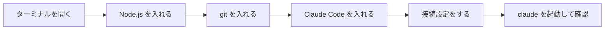

# Step 0: 環境構築（Claude Code を動かす）

対象: PC操作はできるが、ターミナル・git・APIキーの概念に触れたことがない人。

## この後どうなるか（全体地図）



全部で6つ。1つずつ「やる → 確認する」を繰り返すだけです。どこかで動かなくなっても壊れることはないので、遠慮なくやり直してください。

## 進め方の3つの約束

1. **手順を読んで黙々と進めない。** エラーが出たら、そのままコピペして https://claude.ai （インストール不要のブラウザ版）に貼って聞く。これが最初の練習です。
2. **15分ルール。** 15分取り組んでも解決しなければ、一人で抱えずサポート役に声をかける。
3. **詰まったら退避してよい。** どうしても解決しない場合は、このインストール作業自体を後回しにして、ブラウザ完結の代替環境に切り替えられます（末尾の「それでも詰まったら」を参照）。

## 事前に用意するもの

- AWS Bedrock 経由のアクセス情報一式（担当者から配布済みのもの）
- 自分のPC（ソフトをインストールできる権限があること。会社PCで権限が無い場合は先にサポート役に確認）

---

## 1. ターミナルを開く

**目的:** これから先の作業は、すべてこの黒い画面（ターミナル）に文字を打ち込んで進めます。

**やること:**

- Mac: `Cmd + Space` を押して検索窓を出し、「ターミナル」と入力して開く
- Windows: スタートボタンを押して「PowerShell」と入力して開く

**確認:** 文字を打ち込める黒っぽい（または白い）ウィンドウが開けば成功。

<details>
<summary>「ターミナルって何？」となった場合</summary>

普段はアイコンをクリックしてアプリを開きますが、ターミナルは「文字でPCに命令する」ための画面です。マウスはほぼ使わず、キーボードで一行ずつ命令を打ち込んで Enter を押します。最初は違和感がありますが、この後の手順を1つずつこなすうちに慣れます。
</details>

---

## 2. Node.js を入れる

**目的:** Claude Code は Node.js という土台の上で動きます。まずその土台を入れます。

**やること:**

1. ブラウザで https://nodejs.org を開く
2. 「LTS」と書かれているボタンをクリックしてダウンロード
3. ダウンロードしたファイルをダブルクリックして、画面の指示どおりに「次へ」を押していく（設定を変える必要はありません）

**確認:** ターミナルに戻り、次を1行打って Enter。

```
node -v
```

`v20.11.0` のような数字が表示されれば成功。

<details>
<summary>「command not found」「認識されていません」と出た場合</summary>

インストーラが完了する前にターミナルを開いていた可能性があります。一度ターミナルを閉じて、もう一度開き直してから `node -v` を試してください。それでも出ない場合は、そのままのエラー文をclaude.aiに貼って聞いてください。
</details>

---

## 3. git を入れる

**目的:** git は変更履歴を記録するための道具です。この後のStepで本格的に使います。

**やること:**

- Mac: すでに入っていることが多いです。まず下の確認コマンドを試してください。入っていなければ、画面の案内に従ってインストールします。
- Windows: https://git-scm.com を開き、「Download for Windows」からインストーラを実行。設定画面がいくつも出ますが、基本すべて「Next」でそのまま進めて問題ありません。

**確認:**

```
git --version
```

`git version 2.xx.x` のように表示されれば成功。

---

## 4. Claude Code を入れる

**目的:** ここからが本番です。今まで入れたNode.jsの上で動く「Claude Code」を入れます。

**やること:** ターミナルに次を1行打って Enter。

```
npm install -g @anthropic-ai/claude-code
```

文字がたくさん流れますが、止まって待っているだけなので何もしなくて大丈夫です。

**確認:**

```
claude --version
```

バージョン番号が表示されれば成功。

<details>
<summary>途中でエラーが赤い文字で出た場合</summary>

赤い文字がすべて「失敗」とは限りません。最後に `claude --version` を試してみて、バージョンが表示されればそのまま先に進んで問題ありません。表示されない場合は、赤い文字の部分をそのままコピーしてclaude.aiに貼って聞いてください。
</details>

---

## 5. 接続設定をする（Bedrock）

**目的:** Claude Codeが実際にAIとやり取りするための「鍵」を設定します。値は担当者から個別に配布されたものを使います。

**Mac の場合:** ターミナルに次を1行ずつ打って Enter（`< >` の部分は配布された実際の値に置き換える）。

```
export CLAUDE_CODE_USE_BEDROCK=1
export AWS_REGION=<配布されたリージョン>
export AWS_ACCESS_KEY_ID=<配布された値>
export AWS_SECRET_ACCESS_KEY=<配布された値>
```

**Windows(PowerShell) の場合:**

```
$env:CLAUDE_CODE_USE_BEDROCK="1"
$env:AWS_REGION="<配布されたリージョン>"
$env:AWS_ACCESS_KEY_ID="<配布された値>"
$env:AWS_SECRET_ACCESS_KEY="<配布された値>"
```

<details>
<summary>この設定は何をしているの？</summary>

Claude CodeはAWS Bedrockという経路を通じてAIと通信します。ここで設定しているのは「あなたがどのAWSアカウントの、どの権限を使って接続するか」という情報です。値そのものの意味を今すぐ理解する必要はありません。
</details>

<details>
<summary>ターミナルを閉じるたびに毎回打つのが面倒</summary>

このやり方は「ターミナルを開いている間だけ」有効な設定です。毎回打つのが面倒に感じたら、その時点でサポート役に相談してください。設定ファイルに書いておく方法を案内します（Step 0では扱いません）。
</details>

---

## 6. 動作確認

**目的:** ここまでの設定が全部つながっているかを確認します。

**やること:**

```
mkdir hello-claude
cd hello-claude
claude
```

Claude Codeが起動し、何か話しかけられる状態になれば **Step 0 完了** です。試しに「自己紹介して」と打ってみましょう。

---

## それでも詰まったら

1. まずエラーメッセージをそのままclaude.aiに貼って聞いてみる。
2. 15分取り組んでも解決しなければ、一人で抱えずサポート役に声をかける。
3. PCの制約（管理者権限がない、社内プロキシで弾かれる等）でどうしても解決しない場合は、ローカルインストールを一旦保留し、**ブラウザ完結の代替環境**（Claude Code on the web）に切り替えてStep 1以降を先に進める。インストールは後回しにしてよい。

インストールの成否は「その人ができるかどうか」の判定材料にしません。詰まったら退避、が正しい進め方です。

## 次のステップ

Step 1: 空リポジトリで `git init` から始める（準備中）。
