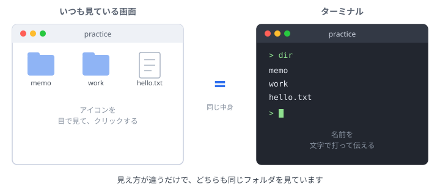
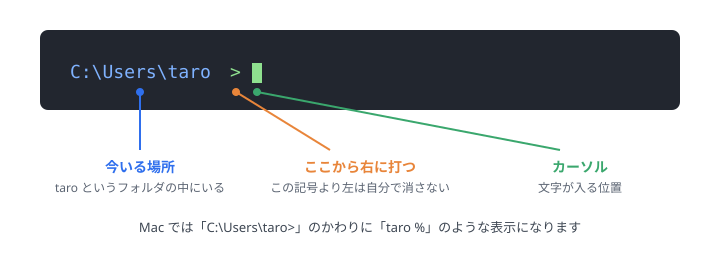
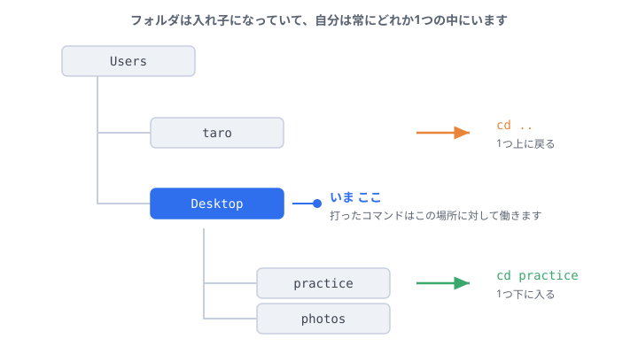
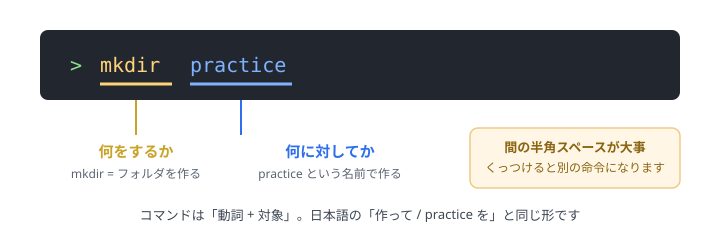

# ターミナル入門 — パソコンに文字で命令してみる

対象: パソコンは使えるが、「黒い画面」を開いたことがない人。

<div class="note">
これは<b>本編が始まる前の、準備運動</b>のページです。黒い画面を触ったことがある人は、飛ばして<a href="setup.html" target="_blank" rel="noopener">環境構築ナビ</a>から始めて構いません。
</div>

ここでは、**まだ何もインストールしません。** VS Code も Claude Code も、次の「環境構築」で入れます。ここでは「文字でパソコンに命令する」感覚だけをつかみます。所要時間は30分ほどです。

## このページのゴール

- 黒い画面が怖くなくなる
- 「自分が今どこにいるか」がわかる
- フォルダを **見る・移動する・作る** ができる

---

## そもそも、あの黒い画面は何なのか

普段みなさんは、フォルダのアイコンをダブルクリックして中身を見ていると思います。あれと**まったく同じこと**を、文字で行うのがターミナル（Windowsではコマンドプロンプト）です。



つまり、別世界に入るわけではありません。**いつも見ているフォルダを、別の見せ方で見ているだけ**です。ここが腑に落ちると、一気に怖くなくなります。

<details>
<summary>じゃあ、なぜわざわざ文字で命令するの？</summary>

クリックだと1回に1つの操作しかできませんが、文字なら「100個のファイルの名前を一括で変える」といった指示が一行で書けます。そして何より、**AIに『この命令を打って』と伝えてもらえる**のが大きな利点です。この後Claude Codeを使うとき、AIはこの文字の形で手順を教えてくれます。
</details>

---

## 1. 開いてみる

<!-- tabs:start -->

#### **Windows**

1. キーボードの `Windowsキー` を押す
2. そのまま `powershell` と入力する
3. 出てきた「Windows PowerShell」を選んで Enter

#### **Mac**

1. `Cmd + Space` を押す（画面中央に検索窓が出ます）
2. そのまま `ターミナル` と入力する
3. 出てきた「ターミナル」を選んで Enter

<!-- tabs:end -->

**確認:** 文字が並んだウィンドウが開けば成功です。何も壊れていません。

<div class="note">
この先の研修では、この黒い画面を <b>VS Code の中</b>（「表示 &gt; ターミナル」）で開いて使います。<b>どちらも同じもの</b>なので、ここで覚えた操作はそのまま使えます。
</div>

---

## 2. 画面の読み方

開いた直後、すでに何か文字が表示されているはずです。これは**エラーではありません。** 意味はこうです。



覚えることは1つだけです。**記号（`>` や `%`）より右側に自分で打つ。** 左側は勝手に表示されるもので、消す必要はありません。

---

## 3. 「今どこにいるか」を知る

ターミナルでは、常に**どこか1つのフォルダの中に立っている**状態です。これが最初の関門ですが、図にすると単純です。



打ったコマンドは、**今いる場所に対して**働きます。「デスクトップにフォルダを作りたいのに、別の場所に作られた」というつまずきは、だいたい現在地の勘違いが原因です。

現在地を表示するには、次を打って Enter。

<!-- tabs:start -->

#### **Windows**

```
cd
```

#### **Mac**

```
pwd
```

<!-- tabs:end -->

---

## 4. 中身を見る

今いるフォルダに何が入っているかを表示します。

<!-- tabs:start -->

#### **Windows**

```
dir
```

#### **Mac**

```
ls
```

<!-- tabs:end -->

さきほどの図のとおり、これは**フォルダをダブルクリックして中身を見たのと同じこと**です。

---

## 5. 移動する

移動は `cd` （change directory = 場所を変える、の略）を使います。WindowsもMacも同じです。

```
cd Desktop
```

1つ上のフォルダに戻るときは、点を2つ打ちます。

```
cd ..
```

「入る」「戻る」の関係は、3節の図をもう一度見てください。緑の矢印が `cd フォルダ名`、オレンジの矢印が `cd ..` です。

<details>
<summary>フォルダ名を打つのが面倒・間違えるとき</summary>

名前を数文字打って `Tab` キーを押すと、残りを自動で補ってくれます（補完といいます）。打ち間違いが激減するので、慣れないうちから使ってください。

また、前に打ったコマンドは `↑`（上矢印キー）で呼び出せます。打ち直す必要はありません。
</details>

---

## 6. フォルダを作る

`mkdir`（make directory）で作れます。ここでコマンドの「形」を覚えておきましょう。



```
mkdir practice
```

エラーが出なければ成功です。**「何も表示されない = うまくいった」** というのがターミナルの作法で、これも最初は戸惑うポイントです。`dir`（Macは `ls`）で確認してみてください。

---

## 7. 練習（5分）

ここまでに出てきたコマンドだけを使って、次をやってみてください。

1. デスクトップに移動する
2. `practice` という名前のフォルダを作る
3. その中に入る
4. 今どこにいるか表示して、デスクトップの下の `practice` にいることを確認する
5. 1つ上に戻る

<details>
<summary>答え（Windows）</summary>

```
cd Desktop
mkdir practice
cd practice
cd
cd ..
```
</details>

<details>
<summary>答え（Mac）</summary>

```
cd Desktop
mkdir practice
cd practice
pwd
cd ..
```
</details>

作ったフォルダは、デスクトップを見れば**アイコンとしても**見えているはずです。文字で命令した結果が、いつもの画面に現れることを確認してください。

---

## よくあるつまずき

| 表示されたもの | 意味 | どうする |
| --- | --- | --- |
| `is not recognized` / `command not found` | そんな命令は知らない | 打ち間違いがほとんど。スペルとスペースを見直す |
| `No such file or directory` | その名前のフォルダが見当たらない | 現在地が違うことが多い。`dir` / `ls` で中身を確認 |
| 何も表示されずに次の行が出た | **成功** | そのまま次へ進んでよい |
| 打った文字が消せない | 記号より左は消せない仕様 | 気にしなくてよい |

大文字と小文字は区別されることがあります（特にMac）。`Desktop` と `desktop` は別物になり得るので、表示されたとおりに打ってください。

---

## 覚えるのはこれだけ

| やりたいこと | Windows | Mac |
| --- | --- | --- |
| 今どこにいる？ | `cd` | `pwd` |
| 中身を見る | `dir` | `ls` |
| 移動する | `cd 名前` | `cd 名前` |
| 1つ上に戻る | `cd ..` | `cd ..` |
| フォルダを作る | `mkdir 名前` | `mkdir 名前` |

この5つで十分です。残りは必要になったときにAIに聞けば教えてくれます。**全部覚えてから進む必要はありません。**

---

## それでも詰まったら

1. 表示された文字をそのままコピーして https://claude.ai （インストール不要のブラウザ版）に貼り、「これはどういう意味？」と聞いてみる。
2. 15分取り組んでも解決しなければ、一人で抱えずサポート役に声をかける。

## 次のステップ

[環境構築ナビ](setup.html ':ignore target=_blank') で、VS Code と Claude Code を入れます。
