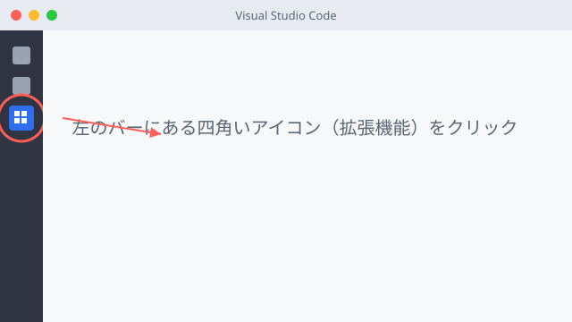
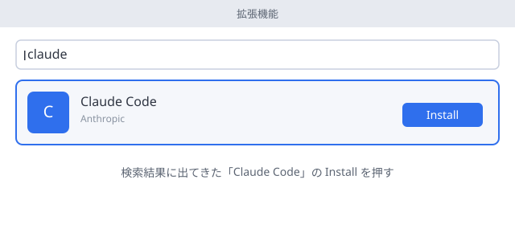

# Step 1: VS Code + Claude Code の環境をつくる

対象: [Step 0](step0-terminal.md) を終えて、ターミナルで `cd` や `dir` / `ls` を打てるようになった人。

このStepでは、**VS Code（エディタ）＋ Claude Code（拡張機能）** という組み合わせで環境を作ります。ターミナルだけの黒い画面より、目で見て操作できる分、最初の抵抗感が少ないはずです。

## 全体は4つの大きな段階だけ

<div class="step-grid">
  <div class="step-card"><div class="step-num">1</div><div class="step-title">土台をそろえる<br>(VS Code)</div></div>
  <div class="step-card"><div class="step-num">2</div><div class="step-title">拡張機能を入れる<br>(Claude Code)</div></div>
  <div class="step-card"><div class="step-num">3</div><div class="step-title">接続設定をする<br>(Bedrock)</div></div>
  <div class="step-card"><div class="step-num">4</div><div class="step-title">動かして<br>確認する</div></div>
</div>

各段階の中はさらに細かい手順がありますが、迷ったら「今この4つのうちどこにいるか」だけ意識すれば大丈夫です。

## 進め方の3つの約束

1. **わからなくなったら、そのままエラーをコピーして https://claude.ai （インストール不要のブラウザ版）に貼って聞く。**
2. **15分ルール。** 15分取り組んでも解決しなければ、一人で抱えずサポート役に声をかける。
3. **詰まったら退避してよい。** どうしても解決しない場合は、この環境構築自体を後回しにして、ブラウザ完結の代替環境に切り替えられます（ページ末尾を参照）。

## 事前に用意するもの

- AWS Bedrock 経由のアクセス情報一式（担当者から配布済みのもの）
- 自分のPC（ソフトをインストールできる権限があること。会社PCで権限が無い場合は先にサポート役に確認）

---

## 段階1: 土台をそろえる（VS Code / Node.js）

**目的:** VS Code は文章を書くための道具（エディタ）、Node.js はその裏でClaude Codeを動かすための土台です。この2つを先に入れます。

<!-- tabs:start -->

#### **Windows**

1. https://code.visualstudio.com を開き、青い「Download for Windows」ボタンをクリック
2. ダウンロードしたファイルをダブルクリックし、「同意する」→「次へ」を選び続けてインストール完了
3. 続けて https://nodejs.org を開き、「LTS」と書かれたボタンからインストーラをダウンロードして実行（設定はすべて既定値のままでよい）

#### **Mac**

1. https://code.visualstudio.com を開き、「Download for Mac」をクリック
2. ダウンロードしたzipを開き、出てきた `Visual Studio Code` を「アプリケーション」フォルダにドラッグ
3. 続けて https://nodejs.org を開き、「LTS」と書かれたボタンからインストーラをダウンロードして実行

<!-- tabs:end -->

**確認:** VS Codeのアイコン（青い蝶のようなマーク）をクリックして起動できれば成功。

念のためNode.jsも確認する場合は、VS Code内のメニュー「表示 > ターミナル」を開いて次を打つ。

```
node -v
```

バージョン番号が表示されればOK。

<details>
<summary>「表示 > ターミナル」って何？</summary>

VS Codeの中にも簡易的なターミナル（黒い画面）を呼び出せます。画面上部のメニューから「表示（View）」→「ターミナル（Terminal）」を選ぶと、画面下側に出てきます。この後の段階でも何度か使います。
</details>

---

## 段階2: Claude Code 拡張機能を入れる

**目的:** VS CodeにAIと対話しながらコードを書ける機能を追加します。

1. VS Code左側の縦に並んだアイコンの中から、四角いブロックのようなアイコン（拡張機能）をクリック

   

2. 検索窓に `claude` と入力する
3. 出てきた「Claude Code」を選び、「Install」ボタンをクリック

   

**確認:** 左側のアイコン一覧にClaude Codeのアイコンが新しく増えていれば成功。

---

## 段階3: 接続設定をする（Bedrock）

**目的:** Claude Codeが実際にAIとやり取りするための「鍵」を設定します。値は担当者から個別に配布されたものを使います。

VS Codeのメニュー「表示 > ターミナル」でターミナルを開き、以下を打ちます（`< >` の部分は配布された実際の値に置き換える）。

<!-- tabs:start -->

#### **Windows**

```
$env:CLAUDE_CODE_USE_BEDROCK="1"
$env:AWS_REGION="<配布されたリージョン>"
$env:AWS_ACCESS_KEY_ID="<配布された値>"
$env:AWS_SECRET_ACCESS_KEY="<配布された値>"
```

#### **Mac**

```
export CLAUDE_CODE_USE_BEDROCK=1
export AWS_REGION=<配布されたリージョン>
export AWS_ACCESS_KEY_ID=<配布された値>
export AWS_SECRET_ACCESS_KEY=<配布された値>
```

<!-- tabs:end -->

<details>
<summary>この設定は何をしているの？</summary>

Claude CodeはAWS Bedrockという経路を通じてAIと通信します。ここで設定しているのは「あなたがどのAWSアカウントの、どの権限を使って接続するか」という情報です。値そのものの意味を今すぐ理解する必要はありません。
</details>

<details>
<summary>ターミナルを閉じるたびに毎回打つのが面倒</summary>

このやり方は「ターミナルを開いている間だけ」有効な設定です。毎回打つのが面倒に感じたら、その時点でサポート役に相談してください。設定ファイルに書いておく方法を案内します（このStepでは扱いません）。
</details>

---

## 段階4: 動かして確認する

**目的:** ここまでの設定が全部つながっているかを確認します。

1. VS Codeで適当なフォルダを開く（「ファイル > フォルダーを開く」から `hello-claude` のような新しいフォルダを作って開く）
2. 左側に増えたClaude Codeのアイコンをクリックしてパネルを開く
3. 「自己紹介して」のように話しかけてみる

返事が返ってくれば **Step 1 完了** です。

---

## それでも詰まったら

1. まずエラーメッセージをそのままclaude.aiに貼って聞いてみる。
2. 15分取り組んでも解決しなければ、一人で抱えずサポート役に声をかける。
3. PCの制約（管理者権限がない、社内プロキシで弾かれる等）でどうしても解決しない場合は、この環境構築を一旦保留し、**ブラウザ完結の代替環境**（Claude Code on the web）に切り替えてStep 2以降を先に進める。インストールは後回しにしてよい。

環境構築の成否は「その人ができるかどうか」の判定材料にしません。詰まったら退避、が正しい進め方です。

<details>
<summary>参考: ターミナルだけで入れる方法（上級者向け）</summary>

VS Codeを使わず、ターミナルから直接Claude Codeを入れることもできます。

```
npm install -g @anthropic-ai/claude-code
claude --version
```

こちらは画面操作がない分、コマンドの意味を理解していないと詰まりやすいので、このStepでは推奨しません。慣れてきたら試してみてください。
</details>

## 次のステップ

Step 2: 空リポジトリで `git init` から始める（準備中）。
