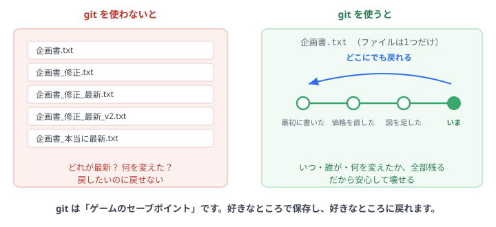
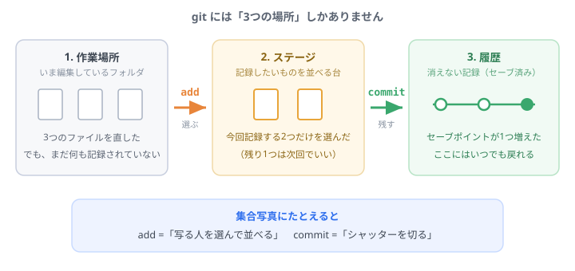
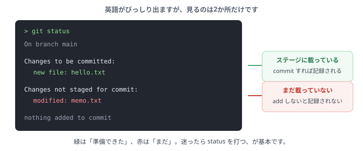
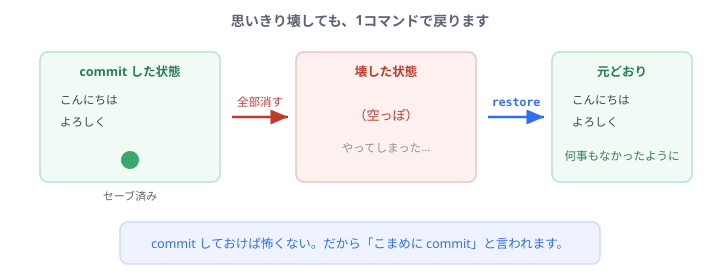

# Step 2: 変更を記録する（git の基本）

対象: [Step 1](step1-setup.md) を終えて、VS Code と Claude Code が動く人。

このページは **10分** で終わります。読むより先に手を動かす順番になっているので、上から順にやってください。

<div class="note">
<strong>先に言っておくと、覚えるコマンドは5つだけです。</strong> しかも Windows と Mac で同じです。全部を理解してから進む必要はありません。
</div>

---

## なぜ git を使うのか <span class="time">30秒</span>



これだけです。**git はゲームのセーブポイント。** 好きなところで保存して、好きなところに戻れます。

<div class="note">
この道具がどうやって生まれたのかは、<a href="#/why-git">寄り道の読み物</a>にまとめてあります。<b>今は読まなくて大丈夫</b>です。
</div>

理屈はこの後わかるので、まず1回やってみましょう。

---

## 1. とにかく1回やってみる <span class="time">3分</span>

環境構築ナビで作った `practice` フォルダを使います。VS Code で開いてください（「ファイル > フォルダーを開く」）。

開いたら、メニューの「表示 > ターミナル」でターミナルを出します。ここから先はすべてそこに打ちます。

### 最初の1回だけ: 自分の名前を教える

git は「誰が記録したか」を残すので、名前とメールを一度だけ登録します。

```
git config --global user.name "あなたの名前"
git config --global user.email "あなたのメールアドレス"
git config --global init.defaultBranch main
```

3行目は「最初の枝の名前を main にそろえる」という指定です。書いておくと、この先の説明と画面が一致します。

<div class="note">
ここで書いた名前とメールアドレスは、<strong>記録に残り、GitHubに上げると他の人にも見えます。</strong>会社のルールがあればそれに従ってください。迷ったらサポート窓口に確認を。後からいつでも変更できます。
</div>

### 記録を始める宣言をする

```
git init
```

これで、このフォルダが「履歴を残すフォルダ」になりました。

<details>
<summary>「hint:」で始まる長い英語が出てきた</summary>

正常です。エラーではありません。「最初の枝の名前を変えられますよ」という案内が出ることがありますが、今は無視して先に進んで問題ありません。最後の行に `Initialized empty Git repository ...` と出ていれば成功です。
</details>

### ファイルを1つ作る

VS Code の左側のファイル一覧で右クリック →「新しいファイル」で `hello.txt` を作り、中に適当な文章を書きます。

<div class="note">
<strong>必ず保存してください（<code>Ctrl + S</code> / <code>Cmd + S</code>）。</strong> VS Code は自動で保存しません。タブに「●」が付いていたら未保存の印です。<strong>保存し忘れは、この先いちばん多いつまずきです。</strong>
</div>

### 記録する

ターミナルに戻って、2行打ちます。

```
git add hello.txt
git commit -m "最初のファイルを作った"
```

<div class="checkpoint">
<strong>ここまでできればOK。</strong> 何行か英語が表示されたら成功です。今あなたは、1つ目のセーブポイントを作りました。意味はまだわからなくて大丈夫です。
</div>

---

## 2. いま何が起きたのか <span class="time">2分</span>



さっき打った2行は、この図の矢印そのものです。

- `git add` … **記録したいファイルを選んで台に載せる**
- `git commit` … **載せたものをまとめて記録する**

「なぜ2段階なのか」と思うかもしれません。10個ファイルを直しても、**今回記録したいのは3個だけ**ということがよくあるからです。写真に写る人を選んでからシャッターを切る、と同じです。

<details>
<summary>-m "..." の部分は何？</summary>

そのセーブポイントの名前です。後から履歴を見たとき、自分と仲間が「何をした記録か」を一目で分かるようにするためのメモだと思ってください。「バグ修正」より「ログイン失敗時のエラー文言を修正」のように具体的に書くと、後の自分が助かります。
</details>

---

## 3. もう一度やって、体に入れる <span class="time">2分</span>

1回だと覚えません。もう一周します。

まず `hello.txt` に何か1行書き足して保存してください。そして、今の状況を git に聞いてみます。

```
git status
```

英語がたくさん出ますが、**見るのは2か所だけ**です。



赤で出ているのが「まだ台に載っていない」ファイルです。載せて記録しましょう。

```
git add hello.txt
git commit -m "説明を1行足した"
```

そして履歴を見てみます。

```
git log --oneline
```

<div class="checkpoint">
<strong>セーブポイントが2つ並んで見えれば成功です。</strong> これがあなたの作業の記録です。
</div>

---

## 4. 壊して、戻す <span class="time">2分</span>

ここが一番大事な体験です。**わざと壊してみましょう。**

`hello.txt` を開いて、**中身を全部消して保存**してください。普段なら青ざめる場面です。



では、戻します。

```
git restore hello.txt
```

VS Code の画面を見てください。**消したはずの文章が戻っています。**

<div class="checkpoint">
<strong>これが git を使う一番の理由です。</strong> commit してあれば、何をやらかしても戻せます。だから安心して試せるし、思いきったことができます。
</div>

<div class="note">
逆に言うと、<strong>commit していないものは戻せません。</strong>「区切りがついたら commit」を癖にしてください。1日1回より、30分に1回くらいの気持ちで十分です。
</div>

---

## 覚えるのはこの5つ

| やりたいこと | コマンド |
| --- | --- |
| 今どうなってる？ | `git status` |
| 記録するものを選ぶ | `git add ファイル名` |
| 記録する | `git commit -m "説明"` |
| 履歴を見る | `git log --oneline` |
| 直前の記録に戻す | `git restore ファイル名` |

Windows も Mac も同じです。**この5つで、しばらく困りません。**

<details>
<summary>全部のファイルをまとめて add したい</summary>

ファイル名のかわりに `.`（ドット）を打つと、変更した全ファイルが対象になります。

```
git add .
```

慣れるまでは1つずつ指定するほうが、「何を記録しようとしているか」を意識できるのでおすすめです。
</details>

---

## 同じことが、ボタンでもできます

ここまでターミナルで打ってきましたが、**VS Code のボタンでもまったく同じこと**ができます。この先のStepではボタン側も出てくるので、対応を知っておいてください。

| ターミナルで打つと | ボタンでは |
| --- | --- |
| `git status` | ソース管理の画面を開く（変更の一覧が見える） |
| `git add` | ファイルの横の「＋」を押す |
| `git commit -m "説明"` | メッセージ欄に書いて「コミット」を押す |

**どちらを使っても結果は同じ**です。やりやすいほうで構いません。慣れるまではボタン、慣れたらターミナルという人が多いです。

---

## 詰まったとき

<div class="note">
<strong>英語のエラーが出ても、読まなくて大丈夫です。</strong> そのままコピーして Claude Code に貼り、「これはどういう意味？どうすればいい？」と聞いてください。これが一番早く、一番身につきます。
</div>

15分取り組んでも進まなければ、一人で抱えずサポート役に声をかけてください。

---

## やってみよう（余力があれば）

Claude Code のパネルを開いて、こう聞いてみてください。

> 今このフォルダで git log を見て、私がこれまで何をしたか説明して

自分の作業履歴を、AIが読んで説明してくれます。**これがこの先の開発の進め方**の入り口です。

## ここまでの確認

できたものにチェックを入れてください。**チェックはこのブラウザに保存され、トップページの進捗に反映されます。**

- [ ] 名前とメールを登録した（最初の1回だけ）
- [ ] `git init` でフォルダを記録対象にした
- [ ] ファイルを作って commit した
- [ ] `git log --oneline` で履歴を見た
- [ ] わざと壊して `git restore` で戻した

## 次のステップ

<a href="github.html" target="_blank" rel="noopener">GitHubナビ: 作った記録を GitHub に上げる</a>（1画面ずつ進む案内）

そのあと「差分を読む」「AIと一緒に直す」と続きます。全体は[トップページ](/)で確認できます。
