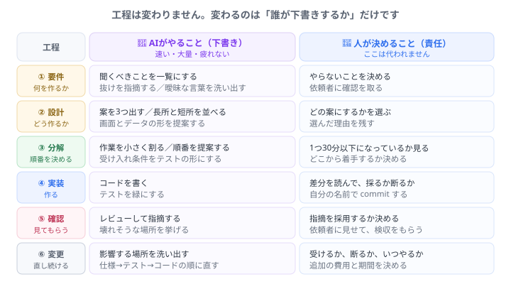

# AI-DLC って何？ — 一人でチームになる方法

AI-DLC は「AIで速くコードを書く方法」ではありません。 
<b>要件を聞くところから、届けて、直し続けるところまでの全部を、AIと一緒に回す進め方</b>のことです。 
そして未経験者にとって、これは<b>いちばん現実的な武器</b>になります。

## まず、誤解をひとつ

AIに書かせるなら、勉強しなくていいのでは？

<b>逆です。</b>書く速さが上がるほど、<b>「これでいいのか」を判断する回数</b>が増えます。判断できない人は、速く走って崖に落ちるだけです。 AI-DLC で本当に伸ばすのは、<b>決める力</b>です。

## 工程は、昔から変わっていません

変わったのは**「誰が下書きするか」だけ**です。

昔は、要件を聞く人、設計する人、書く人、テストする人が**別々にいました**。だから未経験者は「まず書く人」から始めるしかありませんでした。

**いまは違います。** AIが各工程の下書きをするので、**一人でも全工程を回せます。**

<strong>これが、未経験者にとって決定的に有利な変化です。</strong> 「小さくても、最初から最後まで一人で届けられる人」になれる。<b>それは独立の最低条件そのもの</b>です。

## AIに任せてよいもの、だめなもの

**線引きは、はっきりしています。**

| | AIに任せてよい | 人が決める |
| --- | --- | --- |
| **性質** | 速さ・量・網羅 | **責任が生じること** |
| 例 | 聞くべきことの一覧、案を3つ出す、コードを書く、テストを作る、指摘する | **やらないことを決める**、案を選ぶ、差分を採るか断るか、依頼者への確認、いつ・いくらでやるか |

覚え方はひとつです。<b>「あとで責任を問われることは、人が決める」。</b> 
うまくいかなかったとき、<b>「AIがそう言ったので」は通用しません。</b>使ったのはあなただからです。

## なぜ「仕様を先に書く」のか

AI-DLC でいちばん効くのが、**手を動かす前に文章にすること**です。

面倒です。すぐ作り始めたい

気持ちは分かります。でも<b>AIは、あなたが伝えた範囲でしか正しく動けません。</b> 曖昧なまま頼むと、それらしいものが出てきます。<b>それらしいけれど違うもの</b>ほど、直すのが大変なものはありません。

仕様をファイルに書いておくと、こうなります。

- **AIが毎回それを読んでから答える**（`CLAUDE.md` から参照させます）
- **変更が来たとき、どこを直すか分かる**（仕様 → テスト → コードの順）
- **他人に引き継げる**。そして**半年後の自分にも引き継げます**

現場での言い方

仕様を先に決めて、それをテストの形にしてから作ることを、現場では「<b>受け入れ条件を先に決める</b>」と言います。 研修の「仕事の一周」で、<b>最初からテストが赤かった</b>のを覚えていますか。あれがまさにこれです。<b>赤いテストが依頼書</b>でした。

## 小さく回す

<b>1回の一周を、できるだけ小さくしてください。</b> 「アプリを作る」ではなく「入力欄を1つ足す」。 大きく回すと、<b>間違いに気づくのが遅れます</b>。AIは大きな仕事も引き受けてくれますが、大きく間違えます。

## この先でやること

次のステップ「[AIと回す開発の一周](ai-dlc.html ':ignore target=_blank')」では、**AIにクライアント役をやってもらいます。**

> 「うちの店の予約をなんとかしたいんです。今は電話で受けてて…」

この2行から始めて、質問して、仕様にして、作って、見せて、**変更を言われて**、直す。**一周まるごと**やります。

---

- 次へ → [AIと回す開発の一周](ai-dlc.html ':ignore target=_blank')
- 言葉の意味 → [用語集](glossary.md)
- 全体を見る → [トップページ](/)
