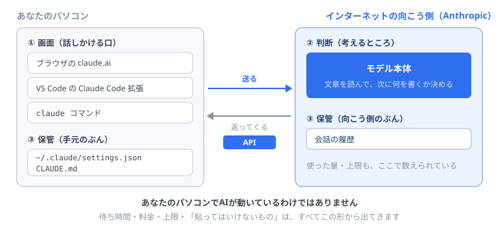

# Claudeを分解してみる — AIも、ただのサービスです

<a href="#/what-is-service">サービスって何？</a>で、GitHub を3つに分解しました。 
同じことを、<b>Claude でやります。</b>AIだけ特別な何かだと思っていると、この先で必ず詰まります。 
分解してみると、<b>GitHub とまったく同じ形</b>をしていることが分かります。作業はありません。

## まず、いちばん多い誤解から

Claude Code って、自分のパソコンの中でAIが動いているんですか？

<b>いいえ。動いていません。</b>あなたのパソコンにあるのは<b>「話しかける口」だけ</b>です。 実際に考えているのは、<b>インターネットの向こう側にある Anthropic のコンピュータ</b>です。だから<b>ネットが切れると、Claude Code は返事をしません。</b>

**これが分かると、いろいろなことが一度に腑に落ちます。** なぜお金がかかるのか、なぜ待たされるのか、なぜ上限があるのか、なぜ「貼ってはいけないもの」があるのか。**全部、同じ理由から出てきます。**

## 3つに分解する

| | GitHub のとき | Claude のとき |
| --- | --- | --- |
| **① 画面（使う口）** | ブラウザのGitHub、`git` コマンド | **claude.ai / VS Code の拡張 / `claude` コマンド** |
| **② 判断（考える所）** | 「この人は書き込んでよいか」を判断 | **モデル本体。文章を読んで、次に何を書くか決める** |
| **③ 保管（覚えている所）** | リポジトリ、Issue、PR | **会話の履歴、`~/.claude` の設定ファイル** |

**①はあなたの手元にあり、②は向こう側にあります。** ③は両方にまたがっています（設定は手元、会話はブラウザなら向こう側）。

<strong>ブラウザの Claude も、Claude Code も、①が違うだけです。</strong> 
考えている②は、まったく同じもの。<a href="#/what-is-claude">そもそも Claude って何？</a>で書いた「頭の中身は同じ」は、この図の話でした。

## ①と②をつないでいるもの＝API

**API**（エーピーアイ）という言葉は、この先ずっと出てきます。ここで一度、はっきりさせておきます。

いちばん近いたとえ

<b>レストランの注文口</b>です。あなたは厨房に入りません。<b>決まった形で注文を渡すと、決まった形で料理が返ってくる。</b>厨房の中がどうなっているかは知らなくていい——それが API です。

Claude の場合、<b>「この文章を送ると、返事の文章が返ってくる」</b>という注文口が用意されています。VS Code の拡張も、ブラウザの画面も、<b>その口を叩いているだけ</b>です。

**だから、こういうことが起きます。**

| 起きること | 理由 |
| --- | --- |
| ネットが切れると使えない | **②が向こう側にあるから** |
| 返事に数秒〜数十秒かかる | **文章を送って、向こうで考えて、返してもらっているから** |
| 使った量でお金がかかる | **向こうのコンピュータを動かしているから** |
| 一度にたくさん使うと止められる | **みんなで1つの厨房を使っているから**（順番待ちです） |

## 「貼ってはいけないもの」の、本当の理由

<strong>あなたが打った文字は、あなたのパソコンを出ていきます。</strong> 
これが理由のすべてです。意地悪でルールがあるのではなく、<b>物理的に外に出る</b>から気をつける必要があるのです。

パスワード、APIキー、お客さんの個人情報、社外に出せない資料——**これらを打つのは、社外のサービスに送信するのと同じ行為**です。会社ごとにルールがあるのは、そのためです。

逆に言えば、<b>「これは外に出しても大丈夫か？」</b>という一問だけ考えれば判断できます。<b>難しいルールを暗記する必要はありません。</b>

## トークンと、コンテキストウィンドウ

サービスには**必ず制限**があります。GitHub にもファイルサイズの上限がありました。Claude の制限は、この2つです。

**トークン** — 文章を細かく区切った単位です。ざっくり**日本語で1〜2文字ぶん**。料金も、上限も、この単位で数えられています。

**コンテキストウィンドウ** — **一度の会話で覚えていられる量**です。ここを超えると、**古い部分から忘れていきます。**

会話が長くなると、AIがおかしくなるのはこれですか？

<b>大きな原因のひとつです。</b>最初に伝えた前提が、window から押し出されて消えているのです。 だから<b><code>/clear</code> で会話を切り直す</b>のが効きます（<a href="theme.html" target="_blank" rel="noopener">自分のテーマで回す</a>でやりました）。そして<b><code>CLAUDE.md</code> に前提を書いておけば、毎回自動で読み込まれる</b>ので、忘れられません。<b>あの2つは、この制限への対策でした。</b>

## 認証 — なぜサインインが要るのか

GitHub のときと、まったく同じ理屈です。

- **誰が使ったか分からないと、料金を請求できない**
- **誰が使ったか分からないと、上限を管理できない**
- **誰が使ったか分からないと、あなたの会話を他人から守れない**

サインインでも、APIキーでも、やっていることは同じ——**「これは私です」と名乗ること**です。だから<b>APIキーはパスワードと同じ扱い</b>になります。

気づきましたか

ここまで出てきた話——<b>クライアントとサーバー、API、認証、制限、料金</b>——は、<b>GitHub でも、あなたが公開したページでも、まったく同じ</b>でした。 
<b>AIだからといって、新しい概念はほとんど出てきていません。</b>Claude は「賢い判断をする、ただのサービス」です。

## 作る側から見ると

<a href="#/what-is-service">サービスって何？</a>の最後で、「使う側から作る側へ」という話をしました。**Claude も同じです。**

**あなたが作るものに、Claude を組み込むことができます。** さっきの「注文口」を、あなたのプログラムから叩けばいいだけです。

たとえば——問い合わせメールを読んで分類する、書いた文章の誤字を直す、データを見て要約する。<b>これらは全部「文章を送って、返事をもらう」だけで作れます。</b> 
<b>いま作れる必要はありません。</b>ただ、<b>「AIは組み込める部品でもある」</b>と知っておいてください。それが分かっている人と、使うだけの人とでは、行ける場所が変わります。

## そして、次の話へ

ここまでで、Claude は「向こう側で考えて、返事をくれるサービス」だと分かりました。

**では、その Claude に GitHub を見せたいときは、どうするのか。**

いまは、あなたが**コピーして貼っています**。PRの差分、Issueの内容、エラーの画面。**それを、AIが自分で見に行けるようにする仕組み**があります。

それが <strong>MCP</strong> です。次のステップで、実際に GitHub とつなぎます。

## まとめ

- Claude は**あなたのPCでは動いていない**。手元にあるのは「話しかける口」だけ
- 分解すると **①画面 ②判断 ③保管**。**GitHub とまったく同じ形**
- ①と②をつなぐのが **API**（＝決まった形の注文口）
- 待ち時間・料金・上限は、**全部「向こう側で動いている」から**出てくる
- **打った文字は、パソコンを出ていく。** 「貼ってはいけないもの」の理由はこれだけ
- 会話が長いとおかしくなるのは **コンテキストウィンドウ**。`/clear` と `CLAUDE.md` がその対策
- **Claude は、あなたが作るものに組み込める部品でもある**

---

寄り道はここまでです。おつかれさまでした。

- 👉 次に進む → [AIに道具を持たせる（MCP × GitHub）](mcp.html ':ignore target=_blank')
- GitHubの分解 → [サービスって何？](what-is-service.md)
- Claudeそのものの話 → [そもそも Claude って何？](what-is-claude.md)
- 全体を見る → [トップページ](/)
