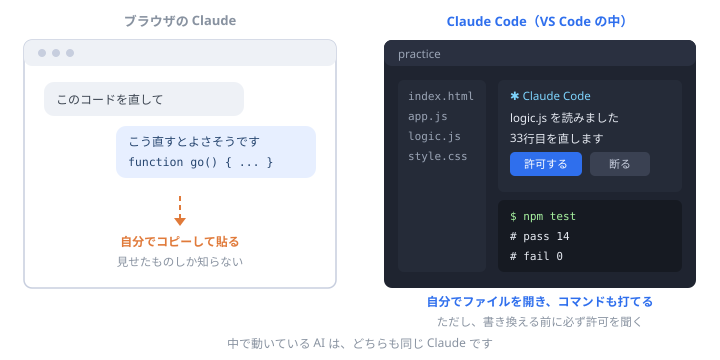

# そもそも Claude って何？ Claude Code とは違うの？

これから「Claude Code を入れてください」と言われます。 
でも、<b>Claude と Claude Code が別物だと気づかないまま</b>進む人がとても多いです。 
ここで5分だけ、手を止めて整理しておきます。<b>作業はありません。</b>

## 1分でわかる、3つの言葉

| 言葉 | 何のこと | たとえるなら |
| --- | --- | --- |
| **Anthropic**（アンソロピック） | AIを作っている**会社** | 車を作っている会社 |
| **Claude**（クロード） | その会社が作った**AI本体** | エンジン |
| **Claude Code**（クロードコード） | Claude を**開発の現場で使うための道具** | そのエンジンを積んだ作業車 |

つまり **Claude Code の中で動いているのは Claude です。** 別のAIではありません。

読み方は「<b>クロード</b>」です。人名（Claude）と同じ綴りで、フランス語圏の名前から来ています。

## ブラウザで使う Claude と、何が違うの？

[claude.ai](https://claude.ai) を開いて話しかけるのが、いちばん素朴な使い方です。**チャットです。**
Claude Code は、その同じAIを **あなたのパソコンの中で働かせる** ためのものです。

| | ブラウザの Claude | Claude Code |
| --- | --- | --- |
| 場所 | ブラウザのタブ | **VS Code の中／ターミナルの中** |
| ファイル | **自分でコピーして貼る** | **AIが自分で開いて読む** |
| 直すとき | 返ってきた文字を自分で貼る | **AIが直接書き換える**（許可を出せば） |
| コマンド | 打てない | **`npm test` などを自分で実行できる** |
| 向いていること | 相談・調べもの・文章 | **実際にコードを直す作業** |

じゃあ、Claude Code のほうが賢いんですか？

<b>いいえ。頭の中身は同じです。</b>違うのは「手が届く範囲」だけです。ブラウザの Claude は、あなたが見せたものしか知りません。Claude Code は<b>自分でファイルを探しに行けます</b>。だから的外れが減るのですが、<b>賢くなったわけではありません</b>。ここを勘違いすると、あとで痛い目に遭います。

## Claude Code は、何ができるのか

大きく4つです。**この4つが、あなたが今後ずっと使う道具です。**

**① ファイルを読む**
「このプロジェクトで、ログインの処理はどこ？」と聞けば、**自分で探して答えます。** あなたがファイルの場所を知らなくても構いません。

**② ファイルを書き換える**
「この関数に、空欄のときのチェックを足して」と頼めば、**その場で書き換えます。** ただし、**書き換える前に「これでいいですか？」と必ず聞いてきます**（この設定は研修の中でやります）。

**③ コマンドを実行する**
テストを走らせる、git の履歴を見る、といったことを**自分で打って、結果を見て、次の判断をします。**

**④ 順番に仕事を進める**
「テストが落ちてる。直して」と言うと、**テストを走らせる → 落ちた場所を読む → 直す → もう一度走らせる**、を自分で繰り返します。

<strong>③と④が、チャットとの決定的な違いです。</strong> チャットのAIは「たぶんこうです」としか言えません。Claude Code は<b>実際に走らせて確かめられます</b>。だから「動くはずです」ではなく「動きました」と言えます。

## できないこと・気をつけること

ここを読まずに使い始めるのが、いちばん危険です。

勝手に何でもやってしまうのでは？

<b>止められます。</b>ファイルを書き換える前、コマンドを打つ前に、<b>許可を求める設定</b>があります。研修では最初にこれをオンにします。<b>「分からないものは断る」が正しい態度</b>です。断っても、AIは怒りません。

間違えることはありますか？

<b>あります。しかも自信たっぷりに間違えます。</b>これは性能の問題ではなく、AIの作りそのものから来る性質です。詳しくは<a href="#/why-ai-mistakes">AIはなぜ間違えるのか</a>で説明しています。<b>だから最後に判断するのは、必ずあなたです。</b>

見せてはいけないものはありますか？

<b>あります。</b>パスワード、APIキー、お客さんの個人情報、社外に出してはいけない資料。これらは<b>貼らない・置かない</b>が原則です。会社ごとにルールがあるので、案件に入ったら<b>初日に確認</b>してください。

豆知識

Claude Code は、<b>Claude Code 自身を使って作られています</b>。作っている人たちが毎日その道具で仕事をしているので、「使っていて困ること」が直に直っていきます。<b>自分の道具を自分で使う</b>——このあと研修の後半で出てくる考え方の、いちばん分かりやすい実例です。

## お金の話（正直に書きます）

**Claude Code は、無料では使えません。** 有料プランに入るか、使ったぶんだけ支払う登録が必要です。

<b>でも、この研修は0円で最後まで進められます。</b>ブラウザの Claude（無料の範囲）を使い、コードは自分でコピーして貼る、というやり方です。<b>学べる内容は1つも減りません。</b>むしろ自分の手で貼るぶん、差分を読む力がつきます。→ <a href="#/alone">担当者がいない人へ（0円で進む）</a>

金額とプランの中身は変わることがあるので、**この教材には金額を書きません。** [claude.com](https://claude.com) で今の内容を確認してください。

## なぜ、この研修は Claude Code を使うのか

理由は3つです。

**① 「動くかどうか」を、その場で確かめられるから**
初心者にとって、いちばんつらいのは「合っているか分からないまま進むこと」です。Claude Code は実際に走らせて確かめられるので、**答え合わせが早い**。

**② 現場のやり方に、そのまま乗るから**
チャットに貼って戻すやり方は、練習にはなりますが、**仕事の速さでは通用しません**。案件で使われている形をそのまま練習できます。

**③ 「AIに全部やらせない練習」ができるから**
逆説的ですが、**AIが直接書き換えられる環境だからこそ、「断る」練習ができます。** 承認ボタンを押す前に差分を読む——この習慣が、この研修でいちばん身につけてほしいものです。

<strong>覚えておいてほしいのは、1つだけです。</strong> 
<b>Claude Code は、あなたの代わりに考える道具ではありません。あなたの考えを、速く形にする道具です。</b> 
判断する人がいなくなったら、その仕事はもう誰の仕事でもありません。

## まとめ

- **Claude** はAI本体、**Claude Code** はそれを開発現場で使うための道具。**中身は同じAI**
- 違いは「手が届く範囲」。**ファイルを読み、書き換え、コマンドを実行できる**
- **賢くなったわけではない。** 自信たっぷりに間違えることがある
- **無料では使えない**が、この研修は**0円ルートでも最後まで行ける**
- 最後に決めるのは、**いつでもあなた**

---

寄り道はここまでです。おつかれさまでした。

- 👉 次に進む → [環境構築](setup.html ':ignore target=_blank')
- AIの間違え方を知る → [AIはなぜ間違えるのか](why-ai-mistakes.md)
- お金をかけずに進む → [担当者がいない人へ](alone.md)
- 全体を見る → [トップページ](/)
