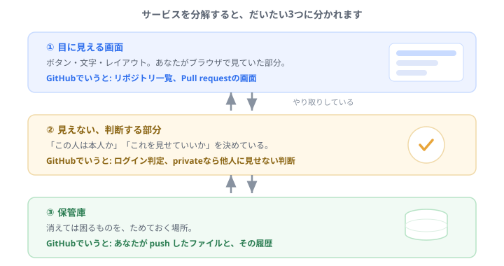
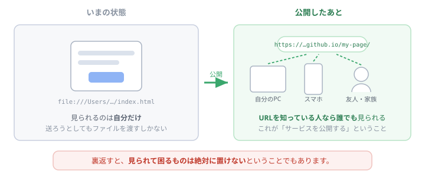
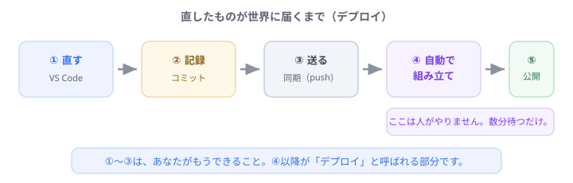

# サービスって何？ GitHubを分解してみる

案件に入ると、初日から「フロント」「サーバー」「デプロイ」といった言葉が飛び交います。 
実は、あなたは<b>もうそのすべてを体験しています</b>。GitHubを使ったときに。 
このページは、<b>やったことに名前を付け直すだけ</b>の回です。新しく覚えることはほとんどありません。

## そもそも「サービス」って何のこと

ざっくり言うと、**誰かのコンピュータで動いていて、ネット越しに使えるもの**です。

GitHub、YouTube、乗換案内、ネットバンキング。全部そうです。あなたのパソコンやスマホには本体が入っていません。**向こう側で動いているものを、借りて使っている**だけです。

じゃあ、自分のパソコンで動かせばよくない？

3つ困ります。<b>①電源を切ったら止まる</b>（他の人が見られない）、<b>②住所がない</b>（誰もたどり着けない）、<b>③大勢が同時に来ると耐えられない</b>。だから「ずっと起動していて、住所があって、丈夫なコンピュータ」を用意します。それを<b>サーバー</b>と呼びます。

ちょっと寄り道

「サーバー」と聞くと、何か特別なスーパーコンピュータを想像しがちですが、<b>中身は普通のパソコンとほとんど同じ</b>です。違うのは役割のほうで、「サービスを提供する（serve する）側」だからサーバー。

実際、あなたのノートパソコンでもサーバーにできます。研修の後半で <code>npx serve</code> のようなコマンドを見ることがありますが、あれは<b>自分のPCを一時的にサーバーにしている</b>だけです。

## GitHubを3つに分解してみる

どんなサービスも、だいたい3つの部分に分かれています。

**① 目に見える画面**（フロントエンド）
あなたがブラウザで見ていた、リポジトリ一覧やPull requestの画面です。**「はじめてのプログラム」で作ったHTMLのページも、まさにこれ**です。あなたはもう、フロントエンドを1つ作っています。

**② 見えない、判断する部分**（バックエンド／サーバー側）
たとえば、あなたのリポジトリを private にしたとき——**「他人には見せない」と決めているのは誰でしょうか。** 画面ではありません。裏側で「この人は持ち主か？」を判定している部分があります。ログインの成否も、ここが決めています。

**③ 保管庫**（データベース／ストレージ）
push したファイル、コミットの履歴、Pull requestの文章。**消えては困るもの**が、ここにたまっています。あなたが別のパソコンからログインしても同じものが見えるのは、ここに残っているからです。

## あなたがやった操作の、業界での呼び名

全部おぼえないとダメ？

<b>いいえ。</b>「聞いたことがある」で十分です。会話で出てきたときに「あ、あれのことか」と思えれば、それで目的は達成しています。

| あなたがやったこと | 業界での呼び名 |
| --- | --- |
| アカウントを作った | ユーザー登録・**サインアップ** |
| メールのコードを入れた | **本人確認**（二要素認証もこの仲間） |
| ログインした | **認証**（あなたが誰かを確かめる） |
| private にして他人に見せなくした | **認可**（何をしてよいかを決める） |
| push した | データを**サーバーに送信**した |
| GitHubの画面が表示された | **リクエスト**を送り、**レスポンス**が返ってきた |
| ブランチを公開した | **デプロイ**の一種 |

豆知識

GitHub も、誰かが書いたコードで動いています。だから<b>障害も起きます</b>。実際、GitHub には稼働状況を知らせる専用ページ（ステータスページ）があり、不調のときはそこに出ます。「自分のせいだと思って何時間も悩んでいたら、サービス側の障害だった」というのは、プロでも普通にある話です。

## 「使う側」から「作る側」へ

ここまでは、あなたは**サービスを使う側**でした。

でも、「はじめてのプログラム」でHTMLのページを作った時点で、実は**部品はもう手元にあります**。足りないのは「向こう側に置いて、住所を付ける」ことだけです。

今のあなたのページは、パソコンの中にあるだけ。**友達に見せたければ、ファイルを渡すしかありません**。

これを公開すると、`https://…` で始まる**住所（URL）**が付きます。そうなれば、スマホからでも、遠くの人からでも、同じものが見られます。

ちょっと寄り道

ちなみに、<b>あなたが今読んでいるこのページも同じ仕組み</b>です。研修サイトは特別なシステムではなく、HTMLとJavaScriptのファイルをGitHubに置いて、公開しているだけ。

つまり、この後やる作業をもう少し積み重ねれば、<b>これと同じものが自分で作れます</b>。

## 直したものが世界に届くまで

①〜③は、**あなたがもうできること**です。④からが「デプロイ」と呼ばれる部分ですが、これは人が手でやるものではなく、**自動で走ります**。押して、数分待つだけ。

案件で「デプロイしました」「本番に上げます」と言われたら、この図の④〜⑤のことだと思ってください。

## まとめ

- サービス＝**誰かのコンピュータで動いていて、ネット越しに使えるもの**
- どれも **①画面 ②判断する部分 ③保管庫** に分かれている
- サーバーは特別な機械ではなく、**役割の名前**
- あなたはすでに、認証・認可・デプロイを**体験済み**
- 足りないのは「向こう側に置いて住所を付ける」ことだけ

---

理屈はここまでです。**次は、実際に自分のページを世界に公開してみましょう。**

- 👉 次に進む → [自分のページを世界に公開する](publish.html ':ignore target=_blank')
- 言葉の意味を確認する → [用語集](glossary.md)
- 全体を見る → [トップページ](/)
