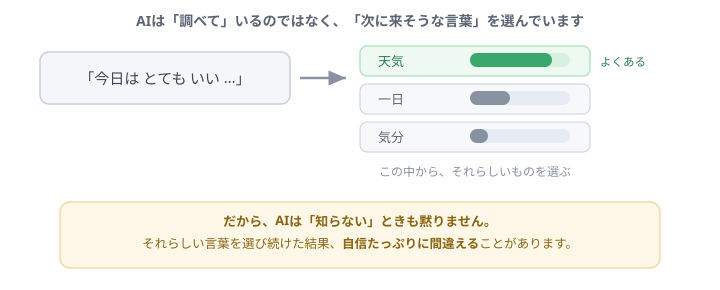
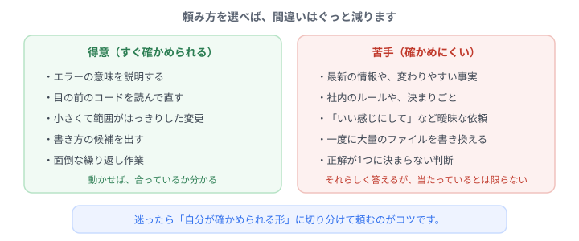

# AIはなぜ間違えるのか

Claude は、たいていのことを親切に答えてくれます。 
でもときどき、<b>堂々と、まったくの間違い</b>を答えます。しかも謝りもせず、自信たっぷりに。 
これは故障ではありません。<b>仕組みからくる性質</b>です。知っておくと、付き合い方が変わります。

## AIは「調べて」いません

いちばん大きな誤解がこれです。AIは辞書やデータベースを引いて答えているわけではありません。

やっていることを乱暴に言うと、**「次に来そうな言葉を選ぶ」の繰り返し**です。

「今日はとてもいい」まで来たら、次は「天気」が来そうだ。それを選ぶ。また次を選ぶ。これを高速で繰り返して、文章ができあがります。

膨大な量の文章を読んで**「言葉のつながり方の癖」**を身につけているので、この方法でも驚くほど的確な答えが出ます。プログラムも同じです。「この書き出しなら、次はこう続くはずだ」という感覚で書いています。

ちょっと寄り道

だから AI は、<b>知らないときも黙りません</b>。「それらしい続き」は、知らなくても作れてしまうからです。

人間なら「うーん、分からないです」と言う場面で、AIはスラスラと自信たっぷりの答えを返してくる。<b>これがいちばん怖いところ</b>です。間違いが「間違いっぽい顔」をしていません。

## 特に間違えやすい場面

最新の情報はどうなの？

AIは<b>ある時点までの文章</b>を読んで学んでいます。それより後に出たツールの新機能や、最近変わった仕様は知りません。しかも「知らない」と気づかずに、<b>昔の情報で答えてしまう</b>ことがあります。

社内のルールは？

知りようがありません。あなたの会社のコーディング規約も、案件独自の決まりごとも、伝えなければ分かりません。<b>伝えれば守れます</b>が、伝えなければ一般論で答えます。

「いい感じにして」と頼んだら？

AIなりの「いい感じ」で返ってきます。それがあなたの期待と一致する保証はありません。<b>曖昧な依頼は、外れやすい依頼</b>です。

## じゃあ、どう頼めばいいのか

答えはシンプルで、**「自分が確かめられる形」で頼む**ことです。

左側は、**頼んだ結果をその場で検証できる**ものばかりです。エラーの説明は「直るかどうか」で分かる。小さな変更は「動くかどうか」で分かる。**間違っていてもすぐ気づける**ので、安心して任せられます。

右側は逆で、**合っているかどうかを自分で判断できない**ものです。ここを丸投げすると、間違いに気づかないまま進んでしまいます。

豆知識

研修で「差分を読む」練習をしたのは、まさにこのためです。<b>AIの答えを検証する手段</b>を先に持っておけば、AIの間違いは怖くありません。逆に検証手段がないまま使うと、間違いがそのまま自分の成果物になります。

## 実際に使うときの4つのコツ

**① 範囲を区切る**
「このファイルの、この関数だけ」と限定します。範囲が狭いほど、間違いは見つけやすくなります。

**② 分からなければ聞き返してもらう**
「不明点があれば、作業前に質問して」と一言添えるだけで、勝手な推測がぐっと減ります。

**③ 根拠を聞く**
「なぜそう書いたのか説明して」と聞くと、怪しい部分が見えてきます。説明が曖昧なら、答えも怪しいと思っていいです。

**④ 動かして確かめる**
最終的にはこれです。**動いたかどうかが唯一の真実**で、AIの説明が上手いかどうかは関係ありません。

## 間違えるからといって、使わないのは損です

ここまで注意点ばかり書きましたが、**AIを警戒しすぎる必要はありません**。

英語のエラーを一瞬で日本語にしてくれる。知らない書き方を教えてくれる。面倒な繰り返しを代わりにやってくれる。**未経験者にとって、これほど心強い相棒はいません**。

大事なのは、**AIを「絶対に正しい先生」ではなく「とても優秀だけど、たまに勘違いする同僚」**だと思うことです。同僚の提案は聞きますが、鵜呑みにはしませんよね。それと同じ距離感が、ちょうどいい。

ちょっと寄り道

ちなみに、ここまで読んだあなたはもう<b>「AIの答えを検証できる人」</b>です。差分が読めて、動かして確かめられて、commit で戻せる。

この3つを持っているかどうかが、AIを<b>使いこなせる人と、振り回される人</b>の分かれ目になります。

## まとめ

- AIは調べているのではなく、**次に来そうな言葉を選んで**いる
- だから**知らないことも、それらしく答えてしまう**
- **確かめられる頼み方**をすれば、間違いはほとんど怖くない
- 距離感は「**優秀だけど、たまに勘違いする同僚**」
- 検証の武器（差分・動作確認・commit）は、もう手に入っています

---

- 👉 次に進む → [はじめてのプログラム](code.html ':ignore target=_blank')
- もう一度使ってみる → [AIと一緒に直す](ai.html ':ignore target=_blank')
- 全体を見る → [トップページ](/)
