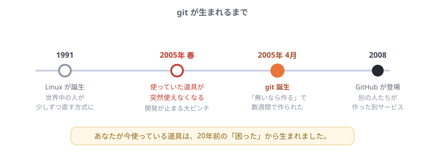
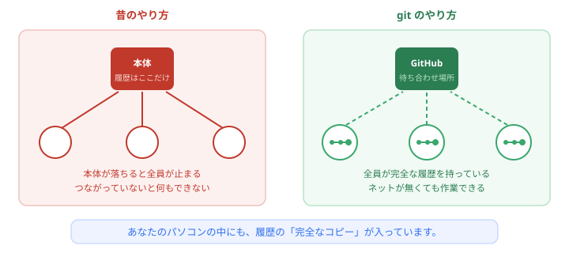
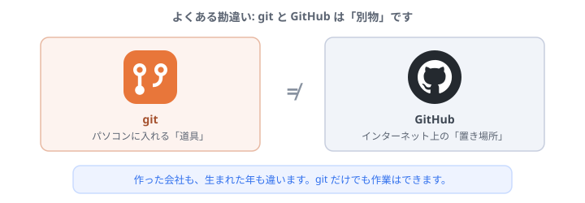

# なぜ git が生まれたのか

毎日のように <code>git add</code> と <code>git commit</code> を打っています。 
でも、この道具は<b>誰が、どうして作ったのか</b>。 
実はけっこうドラマチックな話なので、寄り道して聞いていってください。作業はありません。

## 事件は 2005年に起きました

git は、あるトラブルへの**やけくその対応**として生まれました。

話は1991年にさかのぼります。**Linux**という、世界中の人が少しずつ手を入れて作る大きなソフトウェアがありました。今もスマホやサーバーの中で動いています。

問題は、**世界中に散らばった何千人もの人が、同じものを同時に直している**ことです。誰がどこを変えたのか、どう混ぜるのか。管理しないと、たちまち崩壊します。

そのために使っていた管理ソフトが、**2005年、突然使えなくなりました**。無償で使える条件が取り下げられてしまったのです。

ちょっと寄り道

ここで普通なら「代わりのソフトを探す」ところです。ところがLinuxを作った本人（リーナス・トーバルズ）は、既存のものが<b>どれも気に入らなかった</b>。遅い、使いにくい、思想が合わない。

そこで彼が取った行動が、<b>「じゃあ自分で作る」</b>でした。そして数週間で最初の版を完成させ、ほどなくLinux本体の管理を、その自作ツールに移してしまいます。無茶ですが、それが git です。

## 「速くて、壊れなくて、みんなが自由に動ける」

急ごしらえに見えて、git には最初から強い方針がありました。中でも大きいのが**「中央に頼らない」**という設計です。

昔の管理ソフトは、**履歴を中央のサーバーに1つだけ**置いていました。便利ですが、サーバーが落ちれば全員が止まります。ネットが切れたら何もできません。

git は違います。**参加者全員が、履歴の完全なコピーを持ちます**。

これは他人事ではありません。あなたが `git init` したあの `practice` フォルダにも、**履歴の完全な一式が入っています**。だから飛行機の中でもコミットできるし、GitHubが落ちても手元の作業は続けられます。

じゃあ GitHub は何のためにあるの？

<b>待ち合わせ場所</b>です。全員が完全なコピーを持っているので、あとは「どこで交換するか」を決めればいい。その場所として便利だから、みんなが GitHub に集まっているだけです。

## git と GitHub は、まったくの別物です

ここは初心者が必ず混同するところなので、はっきり書いておきます。

- **git** … 2005年、Linuxの人が作った、パソコンに入れる**道具**
- **GitHub** … 2008年、**まったく別の人たち**が作った、インターネット上の**サービス**

名前が似ているのは、GitHub が git を便利に使うためのサービスだからです。しかし作った人も会社も違います。**git だけでも作業は完結します**（現に「git の基本」では GitHub なしで commit していました）。

豆知識

GitHub は後に Microsoft に買収されました。「Linuxと対立していた会社が、Linuxのために作られた道具のサービスを買った」という、なかなか味わい深い展開です。

## 名前の由来がひどい

「git」という名前には意味があります。作者本人の説明によると、これは**イギリスの俗語で「嫌なやつ」**を指す言葉です。

なぜそんな名前にしたのか。本人いわく「**自分は自己中心的な嫌なやつなので、作ったものには自分にちなんだ名前を付ける。最初は Linux、次は git**」——という自虐ジョークでした。

ちょっと寄り道

世界中のエンジニアが毎日打っているコマンドの名前が、作者の自虐ジョークだった。しかも <b>3文字で打ちやすい</b> というのは、結果的に大正解でした。

もし <code>versioncontrol commit -m "..."</code> と打たされていたら、たぶん今ほど普及していません。<b>道具は、名前の短さも実力のうち</b>という良い例です。

## なぜ commit にあの長い文字列が付くのか

`git log` を見ると、`e8c82af...` のような**謎の文字列**が並んでいたはずです。あれはコミット1つ1つに付く、**世界に1つだけの番号**です。

面白いのは、この番号が**中身から計算されている**ことです。中身が1文字でも違えば、まったく違う番号になります。つまり、**あとから履歴をこっそり書き換えると、番号が合わなくなってバレます**。

「壊れない・ごまかせない」を、git は仕組みで担保しているわけです。

## まとめ

- git は**2005年、道具が使えなくなった緊急事態**から生まれた
- Linuxを作った本人が「無いなら作る」で**数週間で作った**
- 最大の特徴は**全員が完全な履歴を持つ**こと。だから手元だけで作業できる
- **git と GitHub は別物**。作った人も年も違う
- 名前は作者の**自虐ジョーク**

「なんとなく使わされている道具」が、少し身近になったでしょうか。

---

- 続きに戻る → [トップページ](/)
- 言葉の意味を確認する → [用語集](glossary.md)
- 次の寄り道 → [AIはなぜ間違えるのか](why-ai-mistakes.md)
