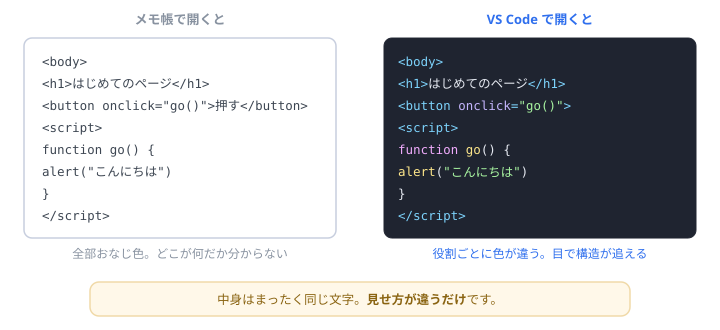
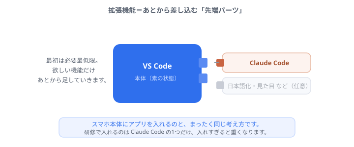
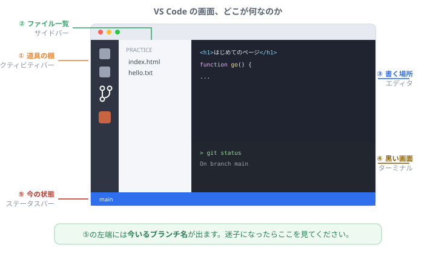

# なぜ VS Code なのか？ 拡張機能って何？

研修では当たり前のように「VS Code を入れてください」と言われました。 
でも、よく考えると変な話です。<b>文字を書くだけなら、メモ帳でもいいはず</b>なのに。 
このページは、手を止めて読む「寄り道」の回です。作業はありません。お茶でも飲みながらどうぞ。

## そもそも、コードって何でできているのか

いきなり結論を言うと、**コードはただの文字**です。

さっき作った `index.html` を、試しにメモ帳で開いてみてください。**普通に開けます**。中身も読めます。書き換えることもできます。特別なファイルではありません。

同じ文字なのに、ずいぶん印象が違いますよね。**中身は1文字も変わっていません。** VS Code が勝手に色を付けて見せているだけです。

ちょっと寄り道

ファイルの名前の最後に付いている <code>.html</code> や <code>.txt</code> を「拡張子」と呼びます。これは<b>中身の種類を表す名札</b>のようなもので、パソコンは名札を見て「じゃあブラウザで開こう」と判断しています。

つまり、<code>memo.txt</code> の名前を <code>memo.html</code> に変えるだけで、ブラウザで開けるようになります。中身は何も変わっていないのに、です。<b>名札を付け替えただけで扱いが変わる</b>——ちょっと不思議で、面白いところです。

## じゃあ、メモ帳と何が違うの？

大きく3つあります。どれも「**人間のミスを減らす**」ための機能です。

### ① 色が付く（構造が目で見える）

さっきの図のとおりです。タグは水色、文字は白、文字列は緑…と役割ごとに色が分かれます。慣れてくると、**色が変な場所で切れている＝どこかで閉じ忘れている**と、読む前に気づけるようになります。

### ② 間違いを教えてくれる

打ち間違えると、その場で**赤い波線**が出ます。ブラウザで開いてエラーを見るより先に気づけるので、圧倒的に早く直せます。

### ③ 続きを勝手に提案してくれる（補完）

`doc` まで打つと `document` が候補に出ます。**Tabキーで確定**。長い単語を全部打つ必要がなく、しかも打ち間違いが起きません。

豆知識

プロのエンジニアも、コマンドや関数名を<b>正確には覚えていません</b>。数文字打って候補から選ぶ、を1日中やっています。「暗記していないと書けない」というのは誤解です。

## なぜ、その中でも「VS Code」なのか

エディタは他にもたくさんあります。それでも研修で VS Code を選んでいる理由は、正直に言うと**機能の良さだけではありません**。

いちばんの理由は？

<b>使っている人がとても多いから</b>です。困って検索したとき、日本語の解説がすぐ見つかります。マイナーな道具を選ぶと、詰まったときに情報がなくて余計に苦労します。<b>初心者にとって「情報の多さ」は機能より価値がある</b>、というのが選定理由です。

ほかにも、こんな理由があります。

| 理由 | 中身 |
| --- | --- |
| 無料 | 個人でも仕事でも無料で使えます |
| Windows も Mac も同じ | 画面がほぼ同じなので、研修の説明を1つにできます |
| ターミナルが中にある | 黒い画面を別アプリで開かなくて済みます |
| **Claude Code が動く** | AIが「住める」エディタである、というのが決定打です |

ちょっと寄り道

名前が紛らわしいのですが、<b>「Visual Studio」と「Visual Studio Code」は別物</b>です。前者は主にWindows向けの大きな開発ソフト、後者（＝VS Code）はもっと軽い、どのOSでも動くエディタです。名字が同じだけの別人、くらいに思ってください。

## 拡張機能ってなに？

VS Code は、買ってきた直後の状態では**わりと素っ気ない道具**です。そこに、必要な機能だけを後から差し込んでいきます。それが拡張機能です。

いちばん近いのは、**スマホとアプリ**の関係です。本体だけでも使えますが、地図が欲しければ地図アプリを入れる。あれと同じで、VS Code も「AIと話したい」から Claude Code を入れました。

たくさん入れたほうがいいの？

<b>いいえ。</b>入れるほど起動が遅くなり、拡張機能どうしがケンカして不具合が出ることもあります。研修で入れたのは<b>1つだけ</b>ですが、それで十分です。「便利そう」で増やすより、<b>困ってから入れる</b>ほうが結果的に快適です。

拡張機能って安全なの？

誰でも公開できる仕組みなので、<b>中には注意が必要なものもあります</b>。作者名と、インストール数を見るのが基本です。研修で入れた Claude Code は、作者が「Anthropic」（Claudeを作っている会社そのもの）になっているのを確認しましたよね。あれが確認のやり方です。

## ついでに：画面のどこが何なのか

毎日見る画面なので、名前を知っておくと説明が通じやすくなります。**覚えなくて大丈夫**です。「そういえば図があったな」くらいで十分。

| 番号 | 名前 | ここは何をするところ |
| --- | --- | --- |
| ① | アクティビティバー | 道具の棚。ファイル一覧・検索・ソース管理・AIを切り替える |
| ② | サイドバー | ①で選んだものの中身が出る場所 |
| ③ | エディタ | 実際に文字を書く場所 |
| ④ | ターミナル | 文字で命令する黒い画面 |
| ⑤ | ステータスバー | **今いるブランチ名**やエラー件数が出る。迷子になったらここ |

豆知識

実は VS Code 自身が、<b>HTML と JavaScript で作られています</b>。あなたが「はじめてのプログラム」で書いたのと、同じ技術です。もちろん規模はまったく違いますが、<b>今学んでいるものの延長線上に、こういう道具を作る世界がある</b>と知っておくと、少し面白くなりませんか。

## まとめ

- コードは**ただの文字**。メモ帳でも書ける
- VS Code は**ミスを減らすための道具**。色・波線・補完がその中身
- 選んでいる最大の理由は「**困ったときに情報が見つかる**」こと
- 拡張機能は**スマホのアプリ**と同じ。必要な分だけ入れる
- 画面の名前は覚えなくていい。**困ったら戻ってくればいい**

---

寄り道はここまでです。おつかれさまでした。

- 👉 次に進む → [git の基本](git.html ':ignore target=_blank')
- 言葉の意味を確認する → [用語集](glossary.md)
- 全体を見る → [トップページ](/)
